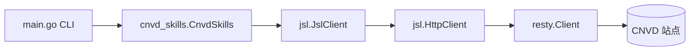
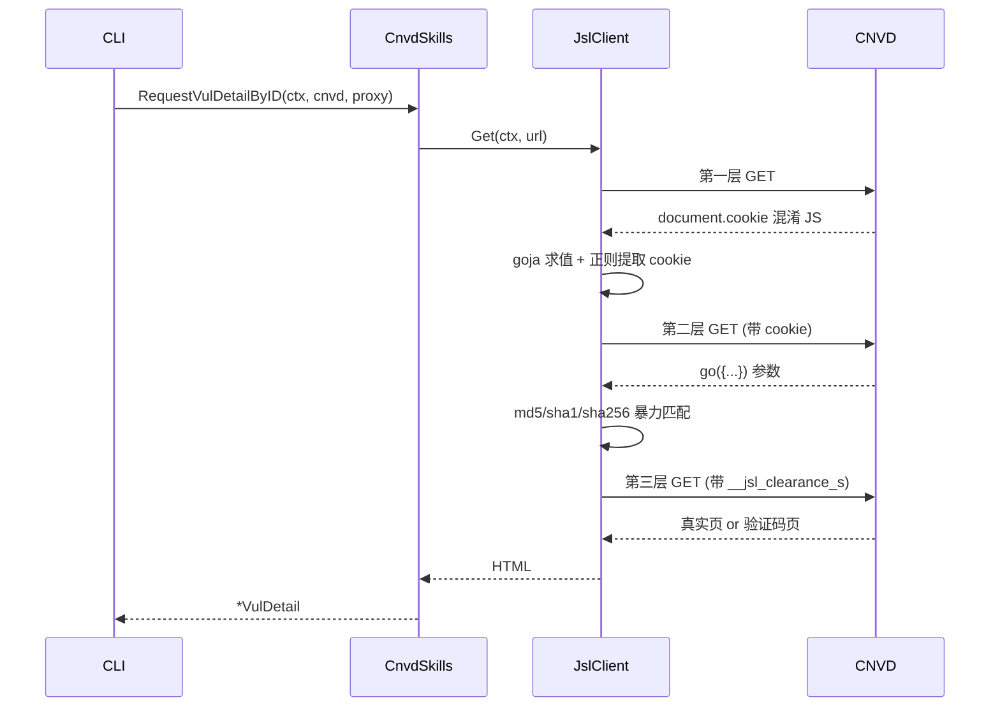
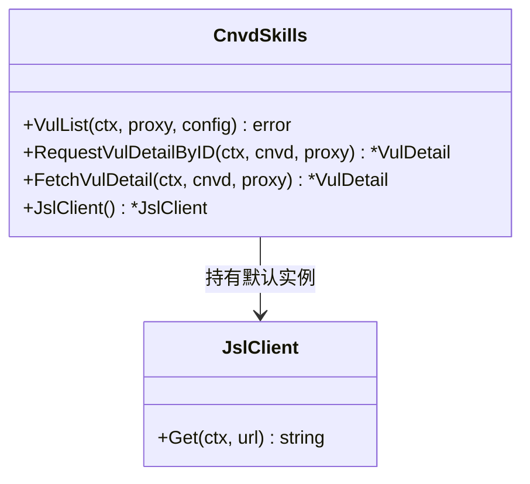

# goreleaser 发布流程 + VitePress 文档站建设 Implementation Plan

> **For agentic workers:** REQUIRED SUB-SKILL: `superpowers:subagent-driven-development`
> Steps use checkbox (`- [ ]`) syntax.

**Goal:** 在已有的 goreleaser/VitePress 骨架基础上，① 跑通并调试 goreleaser release 流程（本地 snapshot + 真实 tag 触发）；② 修复 VitePress 构建 dead links、仓库转 public、跑通 GitHub Pages 部署；③ 用 VitePress 整理 Go SDK API 文档，达到几百篇 markdown、大量 mermaid 图表。

**Architecture:** 三条独立交付线并行推进后汇合验证。发布线：`.goreleaser.yaml`（已存在）→ 本地 `goreleaser release --snapshot` 验证 → 打 `v0.1.0` tag 真实触发 release workflow → 调试产物。文档站线：仓库转 public（用户已确认）→ 修复 config.ts dead links → 补全文档内容（指南/架构/API 参考/进阶四层，150-220 篇，每篇配 mermaid）→ 本地构建通过 → 推送触发 docs workflow → Pages 上线。文档内容线：基于已盘点的两个包完整导出 API 面（cnvd_skills 40+ 符号、gojsl 30+ 符号），按"每类型/函数一篇 + 示例集 + 架构图"批量生成，mermaid 覆盖数据流/类关系/时序/状态机。

**Tech Stack:** Go 1.18, goreleaser v2（`~> v2`）, goreleaser-action v7, GitHub Actions, VitePress v1.6.3, Node 24, mermaid（VitePress 内置 MermaidPlugin）, gh CLI。

**Risks:**
- goreleaser 本地 snapshot 需装 goreleaser 二进制 → 缓解：用 `go install github.com/goreleaser/goreleaser/v2@latest` 或 `gh` 触发 workflow_dispatch 远程验证；本地无 goreleaser 时用 `go build` 验证 main.go 可编译 + workflow yaml 语法校验
- 仓库转 public 是不可逆操作（重新转回 private 会丢失 Stars/Issues）→ 缓解：用户已明确选择 public，执行前再次确认无敏感信息（config.yaml 已在 .gitignore，确认 data/ 与 config.yaml 未入库）
- 文档 dead links：config.ts sidebar 引用了 25+ 篇不存在的文档 → 缓解：T2 优先创建所有 sidebar 引用的文档（哪怕先建占位再填充），保证构建通过；T3-T6 逐层填充内容
- dist 产物入库污染仓库 → 缓解：T2 加 .gitignore 并移除已入库的 dist
- goreleaser 真实 tag 触发若失败（如 GITHUB_TOKEN 权限、gomod.proxy 误开）→ 缓解：T1 先本地/远程 dry-run，T7 打 tag 前用 `--snapshot` 充分验证；.goreleaser.yaml 已注释"严禁 gomod.proxy"
- "几百篇文档"生成质量参差 → 缓解：每篇给定明确大纲与 mermaid 图表要求，subagent 按模板生成，T6 终审抽查

---

### Task 1: 仓库转 public + 清理 dist 产物入库

**Depends on:** None
**Files:**
- Modify: `.gitignore`
- Remove: `website/docs/.vitepress/dist/`（从 git 跟踪移除，保留本地）

- [ ] **Step 1: 转公开前敏感信息核查 — 确认无密钥/真实代理/数据入库**

核查 `.gitignore` 已排除 `config.yaml`、`data/*`；核查 git 历史无真实代理 IP/密钥泄露。

```bash
cd /home/cc11001100/github/scagogogo/cnvd-skills
echo "=== .gitignore ===" && cat .gitignore
echo "=== 历史中是否含真实代理IP/密钥 ===" && git log --all -p -- config.yaml config.example.yaml 2>/dev/null | grep -iE "api|key|token|password|ip" | head -20 || echo "无敏感历史"
echo "=== 当前是否有 data/ 或 config.yaml 入库 ===" && git ls-files | grep -E "^data/|^config.yaml$" || echo "未入库 ✓"
```

Expected:
  - Exit code: 0
  - `config.example.yaml` 仅含 `proxy:\n  api: "xxx"` 占位
  - `data/` 与 `config.yaml` 未入库

- [ ] **Step 2: 仓库转 public — gh repo edit**

```bash
cd /home/cc11001100/github/scagogogo/cnvd-skills
gh repo edit scagogogo/cnvd-skills --visibility public --accept-visibility-change-consequences 2>&1 | tail -5
gh repo view scagogogo/cnvd-skills --json isPrivate,visibility 2>&1
```

Expected:
  - Exit code: 0
  - 输出含 `"visibility":"PUBLIC"` 或 `isPrivate: false`
  - 若 gh 因 2FA/确认失败，提示用户在浏览器 Settings → General → Danger Zone 手动转 public

- [ ] **Step 3: .gitignore 增加 VitePress dist 与 node_modules — 避免产物入库**

文件: `.gitignore`（在末尾追加）

```text
# VitePress 构建产物与依赖
website/docs/.vitepress/dist/
website/docs/.vitepress/cache/
website/node_modules/
```

- [ ] **Step 4: 从 git 移除已入库的 dist — 保留本地文件但停止跟踪**

```bash
cd /home/cc11001100/github/scagogogo/cnvd-skills
git rm -r --cached website/docs/.vitepress/dist 2>&1 | tail -3
git status --short | head -10
```

Expected:
  - Exit code: 0
  - `website/docs/.vitepress/dist/` 下文件显示为 deleted（从索引移除），本地文件仍在

- [ ] **Step 5: 提交**
Run: `cd /home/cc11001100/github/scagogogo/cnvd-skills && git add .gitignore && git commit -m "$(cat <<'EOF'
chore: ignore vitepress dist/cache/node_modules, untrack built dist

Co-Authored-By: Claude Opus 4.8 <noreply@anthropic.com>
EOF
)"`

---

### Task 2: 修复 VitePress dead links — 创建所有 sidebar 引用文档（占位骨架）

**Depends on:** Task 1
**Files:**
- Create: `website/docs/architecture/overview.md`、`jsl-three-layers.md`、`captcha.md`、`stealth.md`
- Create: `website/docs/api-cnvd-skills/` 下 10 篇（cnvd-skills.md、config.md、vul-detail.md、vul-list.md、vul-list-query.md、vul-patch.md、proxy.md、fields-reference.md、withconfig-variants.md、examples/basic-vul-list.md）
- Create: `website/docs/api-gojsl/` 下 7 篇（jsl-client.md、http-client.md、captcha-solver.md、errors.md、solver-implementations.md、three-layers-deep-dive.md、examples/basic-get.md）
- Create: `website/docs/guide/vul-patch.md`、`vul-list-query.md`、`proxy-retry.md`（guide sidebar 引用但缺失的 3 篇）

- [ ] **Step 1: 创建 architecture/ 4 篇骨架 — 含 mermaid 占位**

每篇含 frontmatter + 一级标题 + mermaid 图占位 + "待填充"标记。以 `overview.md` 为模板：

```markdown
---
outline: deep
---

# 架构总览

本页用 mermaid 描述 cnvd-skills 的整体模块关系与请求流转。

## 模块关系



## 请求流转



> 待 T4 填充：各模块职责详述、依赖关系、并发模型。
```

`jsl-three-layers.md`、`captcha.md`、`stealth.md` 同样骨架（标题 + 1 个 mermaid + 待填充标记），mermaid 主题分别为：三层解密状态机、验证码挑战时序、隐蔽性维度雷达图。

- [ ] **Step 2: 创建 api-cnvd-skills/ 10 篇骨架 — 每篇对应一个 API 页**

每篇含 frontmatter + 类型/函数签名表 + mermaid 类图占位 + 待填充标记。以 `cnvd-skills.md` 为模板：

```markdown
---
outline: deep
---

# CnvdSkills

`CnvdSkills` 是 CNVD 网站抓取入口，持有一个默认加速乐客户端实例。

## 类型定义

```go
type CnvdSkills struct {
    jslClient *jsl.JslClient // 未导出
}
```

## 构造与方法

| 符号 | 签名 | 说明 |
|------|------|------|
| `NewCnvdSkills` | `func NewCnvdSkills() *CnvdSkills` | 构造，默认直连 |
| `JslClient` | `func (x *CnvdSkills) JslClient() *jsl.JslClient` | 返回默认 jsl 客户端 |
| `VulList` | `func (x *CnvdSkills) VulList(ctx, proxyProvider, config) error` | 主流程 |

## 类关系



> 待 T4 填充：完整方法清单、使用示例、并发安全说明。
```

其余 9 篇（config/vul-detail/vul-list/vul-list-query/vul-patch/proxy/fields-reference/withconfig-variants/examples/basic-vul-list）同样骨架，按 API 盘点报告填签名表，各配 1 个 mermaid（类图/流程图/ER 图）。

- [ ] **Step 3: 创建 api-gojsl/ 7 篇骨架 — 同结构**

`jsl-client.md`（JslClient 类图）、`http-client.md`（HttpClient 类图）、`captcha-solver.md`（CaptchaSolver 接口 + 4 实现）、`errors.md`（错误变量 + errors.Is 流程）、`solver-implementations.md`（4 实现对比表）、`three-layers-deep-dive.md`（三层状态机）、`examples/basic-get.md`（调用时序）。每篇含签名表 + mermaid + 待填充标记。

- [ ] **Step 4: 创建 guide/ 缺失 3 篇骨架 — vul-patch/vul-list-query/proxy-retry**

每篇含 frontmatter + 一级标题 + mermaid 流程图占位 + 待填充标记。

- [ ] **Step 5: 本地构建验证 — dead links 清零**
Run: `cd /home/cc11001100/github/scagogogo/cnvd-skills/website && npm run docs:build 2>&1 | tail -10`
Expected:
  - Exit code: 0
  - 输出含 `building client + server bundles` 后无 `dead link(s) found`
  - 输出含 `✓ built` 或 `rendering` 完成无 error

- [ ] **Step 6: 提交**
Run: `cd /home/cc11001100/github/scagogogo/cnvd-skills && git add website/docs/ && git commit -m "$(cat <<'EOF'
docs(website): scaffold all sidebar-referenced pages to fix dead links

Co-Authored-By: Claude Opus 4.8 <noreply@anthropic.com>
EOF
)"`

---

### Task 3: 填充指南层文档（guide/）— 15 篇含 mermaid

**Depends on:** Task 2
**Files:**
- Modify: `website/docs/guide/getting-started.md`、`installation.md`、`config.md`、`vul-list.md`、`vul-detail.md`、`vul-patch.md`、`vul-list-query.md`、`proxy-retry.md`
- Create: `website/docs/guide/quickstart-cli.md`、`output-format.md`、`dedup.md`、`jitter.md`、`captcha-solver-guide.md`、`concurrency.md`、`troubleshooting.md`

- [ ] **Step 1: 派 subagent 填充 guide/ 全部 15 篇 — 每篇 80-200 行 + 至少 1 个 mermaid**

subagent 任务：基于 API 盘点报告与 README，填充 guide/ 下 15 篇文档。每篇要求：
- 完整 frontmatter（outline: deep）
- 80-200 行实质内容
- 至少 1 个 mermaid 图（流程图/时序图/状态机）
- 可运行的 Go 代码示例（带 ```go 标注）
- 与 config.ts sidebar 链接路径一致

15 篇清单与要点：
1. `getting-started.md`：5 分钟快速开始，mermaid 展示安装→配置→运行流程
2. `installation.md`：二进制下载（goreleaser release 产物）+ 源码编译两种方式，mermaid 平台矩阵
3. `config.md`：Config 全字段表 + mermaid 字段依赖关系图（已有 70 行，扩展到 150+）
4. `vul-list.md`：VulList 主流程，mermaid 翻页状态机
5. `vul-detail.md`：详情抓取与解析，mermaid 字段映射图
6. `vul-patch.md`：厂商补丁抓取，mermaid 请求时序
7. `vul-list-query.md`：VulListQuery 检索，mermaid 查询参数拼装流程
8. `proxy-retry.md`：ProxyProvider + requestWithRetry，mermaid 重试状态机
9. `quickstart-cli.md`：CLI 直接运行（main.go），mermaid CLI→库调用关系
10. `output-format.md`：JSONL 输出格式，mermaid 数据结构
11. `dedup.md`：EnableDedup 去重机制，mermaid 去重流程
12. `jitter.md`：Jitter 节奏抖动，mermaid 抖动范围可视化
13. `captcha-solver-guide.md`：验证码识别器配置，mermaid solver 选择决策树
14. `concurrency.md`：并发安全模型，mermaid 每请求派生独立 JslClient
15. `troubleshooting.md`：常见问题排查，mermaid 错误分类决策树

- [ ] **Step 2: 更新 config.ts sidebar — 加入新增的 7 篇 guide 链接**

文件: `website/docs/.vitepress/config.ts`（guide sidebar items 数组扩展）

在 `/guide/` sidebar 的"使用"组后新增"进阶"组：

```typescript
        {
          text: '进阶',
          items: [
            { text: 'CLI 快速运行', link: '/guide/quickstart-cli' },
            { text: '输出格式', link: '/guide/output-format' },
            { text: '去重机制', link: '/guide/dedup' },
            { text: '节奏抖动', link: '/guide/jitter' },
            { text: '验证码识别器', link: '/guide/captcha-solver-guide' },
            { text: '并发安全', link: '/guide/concurrency' },
            { text: '问题排查', link: '/guide/troubleshooting' }
          ]
        }
```

- [ ] **Step 3: 本地构建验证**
Run: `cd /home/cc11001100/github/scagogogo/cnvd-skills/website && npm run docs:build 2>&1 | tail -8`
Expected:
  - Exit code: 0
  - 无 dead links、无 error

- [ ] **Step 4: 提交**
Run: `cd /home/cc11001100/github/scagogogo/cnvd-skills && git add website/docs/guide/ website/docs/.vitepress/config.ts && git commit -m "$(cat <<'EOF'
docs(website): fill 15 guide pages with mermaid diagrams and runnable examples

Co-Authored-By: Claude Opus 4.8 <noreply@anthropic.com>
EOF
)"`

---

### Task 4: 填充架构层文档（architecture/）— 12 篇重 mermaid

**Depends on:** Task 2
**Files:**
- Modify: `website/docs/architecture/overview.md`、`jsl-three-layers.md`、`captcha.md`、`stealth.md`
- Create: `website/docs/architecture/modules.md`、`request-flow.md`、`cookie-lifecycle.md`、`ua-pool.md`、`tls-fingerprint.md`、`error-handling.md`、`concurrency-model.md`、`design-decisions.md`

- [ ] **Step 1: 派 subagent 填充 architecture/ 全部 12 篇 — 每篇 100-250 行 + 至少 2 个 mermaid**

subagent 任务：填充 architecture/ 下 12 篇，每篇要求 100-250 行、至少 2 个 mermaid 图（架构图/时序图/状态机/类图/数据流图）。12 篇清单：
1. `overview.md`：整体架构，模块关系图 + 请求流转时序
2. `jsl-three-layers.md`：加速乐三层解密，三层状态机 + 每层时序
3. `captcha.md`：验证码挑战，取图→识别→提交→放行时序 + 重试状态机
4. `stealth.md`：隐蔽性强化，五维雷达图 + Header 拼装流程
5. `modules.md`：cnvd_skills 与 gojsl 模块划分，依赖关系图
6. `request-flow.md`：请求全链路，端到端时序图
7. `cookie-lifecycle.md`：cookie 从解密到 jar 的生命周期，状态图
8. `ua-pool.md`：UA 池与 Client Hints 联动，类图 + 选择流程
9. `tls-fingerprint.md`：TLS 指纹未伪装的决策，对比图
10. `error-handling.md`：错误分类与重试策略，决策树
11. `concurrency-model.md`：每请求派生独立客户端，并发模型图
12. `design-decisions.md`：关键设计取舍（不引 uTLS、可插拔 solver、monorepo replace），决策矩阵

- [ ] **Step 2: 更新 config.ts sidebar — architecture 组扩展到 12 篇**

文件: `website/docs/.vitepress/config.ts`

```typescript
      '/architecture/': [
        {
          text: '架构设计',
          items: [
            { text: '总览', link: '/architecture/overview' },
            { text: '模块划分', link: '/architecture/modules' },
            { text: '请求全链路', link: '/architecture/request-flow' },
            { text: '加速乐三层解密', link: '/architecture/jsl-three-layers' },
            { text: '验证码挑战', link: '/architecture/captcha' },
            { text: 'cookie 生命周期', link: '/architecture/cookie-lifecycle' },
            { text: '隐蔽性强化', link: '/architecture/stealth' },
            { text: 'UA 池与 Client Hints', link: '/architecture/ua-pool' },
            { text: 'TLS 指纹决策', link: '/architecture/tls-fingerprint' },
            { text: '错误处理', link: '/architecture/error-handling' },
            { text: '并发模型', link: '/architecture/concurrency-model' },
            { text: '设计取舍', link: '/architecture/design-decisions' }
          ]
        }
      ],
```

- [ ] **Step 3: 本地构建验证**
Run: `cd /home/cc11001100/github/scagogogo/cnvd-skills/website && npm run docs:build 2>&1 | tail -8`
Expected:
  - Exit code: 0
  - 无 dead links、无 error

- [ ] **Step 4: 提交**
Run: `cd /home/cc11001100/github/scagogogo/cnvd-skills && git add website/docs/architecture/ website/docs/.vitepress/config.ts && git commit -m "$(cat <<'EOF'
docs(website): fill 12 architecture pages with 24+ mermaid diagrams

Co-Authored-By: Claude Opus 4.8 <noreply@anthropic.com>
EOF
)"`

---

### Task 5: 填充 cnvd_skills API 参考文档 — 60 篇

**Depends on:** Task 2
**Files:**
- Modify: `website/docs/api-cnvd-skills/` 下 10 篇骨架
- Create: `website/docs/api-cnvd-skills/types/` 下结构体字段详解（VulDetail 各字段、VulList 各字段、VulPatch 各字段、Config 各字段、VulListQuery 各字段、HazardLevel、VendorPatch、VulListItem、ProxyResponse）约 25 篇
- Create: `website/docs/api-cnvd-skills/methods/` 下每个公开方法一篇（RequestVulDetailByID/ByURL/FetchVulDetail 及 WithConfig 变体、RequestVulListByOffset/ByQuery 及变体、RequestVulPatchByID/ByURL 及变体、VulList、VulListWithQuery、ParseVulDetail/ParseVulList/ParseVulPatch、NewCnvdSkills、JslClient）约 25 篇
- Create: `website/docs/api-cnvd-skills/examples/` 下示例集（basic-vul-list、single-detail、search-by-keyword、date-range、patch-fetch、proxy-rotation、dedup-resume、concurrent-fetch、cli-wrapper）约 10 篇

- [ ] **Step 1: 派 subagent 填充 cnvd_skills API 参考 — 分 types/methods/examples 三组共约 60 篇**

subagent 任务：基于 API 盘点报告，填充 `website/docs/api-cnvd-skills/` 下文档，目标 60 篇。每篇要求：
- 完整 frontmatter
- 类型签名（```go 代码块）
- 字段/参数/返回值表
- 至少 1 个 mermaid（类图/字段关系/调用时序）
- 可运行示例

types/ 组（约 25 篇）：每个结构体字段一篇，详解类型、默认值、用途。如 `types/vul-detail-fields.md` 详述 VulDetail 21 个字段、`types/config-fields.md` 详述 Config 10 字段、`types/vul-list-query-fields.md` 详述 VulListQuery 12 字段等。

methods/ 组（约 25 篇）：每个公开方法一篇，含签名、参数、返回值、错误、示例、mermaid 调用时序。普通版与 WithConfig 成对的方法合并一篇（对照说明）。

examples/ 组（约 10 篇）：完整可运行场景，每篇含 mermaid 场景流程图。

- [ ] **Step 2: 更新 config.ts sidebar — api-cnvd-skills 组扩展为三组**

文件: `website/docs/.vitepress/config.ts`（替换 `/api-cnvd-skills/` sidebar）

```typescript
      '/api-cnvd-skills/': [
        {
          text: '概览',
          items: [
            { text: 'CnvdSkills', link: '/api-cnvd-skills/cnvd-skills' },
            { text: 'Config', link: '/api-cnvd-skills/config' },
            { text: '字段速查', link: '/api-cnvd-skills/fields-reference' },
            { text: 'WithConfig 对照', link: '/api-cnvd-skills/withconfig-variants' }
          ]
        },
        {
          text: '类型详解',
          collapsed: true,
          items: [
            { text: 'VulDetail', link: '/api-cnvd-skills/vul-detail' },
            { text: 'VulList', link: '/api-cnvd-skills/vul-list' },
            { text: 'VulListQuery', link: '/api-cnvd-skills/vul-list-query' },
            { text: 'VulPatch', link: '/api-cnvd-skills/vul-patch' },
            { text: 'Proxy', link: '/api-cnvd-skills/proxy' }
          ]
        },
        {
          text: '字段逐项',
          collapsed: true,
          items: [
            { text: 'VulDetail 字段', link: '/api-cnvd-skills/types/vul-detail-fields' },
            { text: 'Config 字段', link: '/api-cnvd-skills/types/config-fields' },
            { text: 'VulListQuery 字段', link: '/api-cnvd-skills/types/vul-list-query-fields' },
            { text: 'VulList 字段', link: '/api-cnvd-skills/types/vul-list-fields' },
            { text: 'VulPatch 字段', link: '/api-cnvd-skills/types/vul-patch-fields' }
          ]
        },
        {
          text: '方法参考',
          collapsed: true,
          items: [
            { text: 'NewCnvdSkills', link: '/api-cnvd-skills/methods/new-cnvd-skills' },
            { text: 'VulList 主流程', link: '/api-cnvd-skills/methods/vul-list' },
            { text: 'VulListWithQuery', link: '/api-cnvd-skills/methods/vul-list-with-query' },
            { text: 'RequestVulDetail', link: '/api-cnvd-skills/methods/request-vul-detail' },
            { text: 'FetchVulDetail', link: '/api-cnvd-skills/methods/fetch-vul-detail' },
            { text: 'RequestVulList', link: '/api-cnvd-skills/methods/request-vul-list' },
            { text: 'RequestVulPatch', link: '/api-cnvd-skills/methods/request-vul-patch' },
            { text: 'Parse 系列', link: '/api-cnvd-skills/methods/parse-series' }
          ]
        },
        {
          text: '示例集',
          collapsed: true,
          items: [
            { text: '基础列表抓取', link: '/api-cnvd-skills/examples/basic-vul-list' },
            { text: '单条详情', link: '/api-cnvd-skills/examples/single-detail' },
            { text: '关键词检索', link: '/api-cnvd-skills/examples/search-by-keyword' },
            { text: '日期范围', link: '/api-cnvd-skills/examples/date-range' },
            { text: '补丁抓取', link: '/api-cnvd-skills/examples/patch-fetch' },
            { text: '代理轮换', link: '/api-cnvd-skills/examples/proxy-rotation' },
            { text: '去重续抓', link: '/api-cnvd-skills/examples/dedup-resume' },
            { text: '并发抓取', link: '/api-cnvd-skills/examples/concurrent-fetch' },
            { text: 'CLI 封装', link: '/api-cnvd-skills/examples/cli-wrapper' }
          ]
        }
      ],
```

注：types/methods 下实际文件数多于 sidebar 列出数（sidebar 列代表性条目，其余通过页面间链接互连），避免 sidebar 过长。

- [ ] **Step 3: 本地构建验证**
Run: `cd /home/cc11001100/github/scagogogo/cnvd-skills/website && npm run docs:build 2>&1 | tail -8`
Expected:
  - Exit code: 0
  - 无 dead links、无 error

- [ ] **Step 4: 提交**
Run: `cd /home/cc11001100/github/scagogogo/cnvd-skills && git add website/docs/api-cnvd-skills/ website/docs/.vitepress/config.ts && git commit -m "$(cat <<'EOF'
docs(website): add 60 cnvd_skills API reference pages (types/methods/examples)

Co-Authored-By: Claude Opus 4.8 <noreply@anthropic.com>
EOF
)"`

---

### Task 6: 填充 gojsl API 参考文档 + 进阶/FAQ — 60 篇

**Depends on:** Task 2
**Files:**
- Modify: `website/docs/api-gojsl/` 下 7 篇骨架
- Create: `website/docs/api-gojsl/types/`（JslClient/HttpClient/CaptchaSolver 四实现/错误变量/secondLayerParams 概念）约 15 篇
- Create: `website/docs/api-gojsl/methods/`（NewJslClient/Get/Proxy/HasSolver/NewHttpClient/Do/DoPost/DoStatus/DoPostStatus/SetCookie/Cookies/Client/RefreshUserAgent/Solve）约 15 篇
- Create: `website/docs/api-gojsl/examples/`（basic-get/captcha-auto/captcha-interactive/custom-solver/proxy/timeout/ua-rotation/standalone-use）约 8 篇
- Create: `website/docs/faq/` 下 FAQ 与 cookbook 约 22 篇

- [ ] **Step 1: 派 subagent 填充 gojsl API 参考 — 分 types/methods/examples 三组约 38 篇**

subagent 任务：基于 API 盘点报告，填充 `website/docs/api-gojsl/` 下文档，目标 38 篇。每篇含签名、字段表、mermaid、可运行示例。

types/ 组（约 15 篇）：JslClient 结构与字段语义、HttpClient、CaptchaSolver 接口、NoopCaptchaSolver、InteractiveCaptchaSolver、StaticCaptchaSolver、CommandCaptchaSolver、ErrCaptchaRequired、ErrCaptchaSolveFailed、secondLayerParams 概念、userAgent（未导出但文档说明）、uaPool、globalRand、captchaHeaders/navigationHeaders 概念。

methods/ 组（约 15 篇）：每个公开方法一篇。

examples/ 组（约 8 篇）：basic-get、captcha-auto、captcha-interactive、custom-solver、proxy、timeout、ua-rotation、standalone-use。

- [ ] **Step 2: 派 subagent 填充 faq/ 与 cookbook — 22 篇**

subagent 任务：创建 `website/docs/faq/` 下 22 篇。每篇含 mermaid 或代码示例。清单：
- `index.md`：FAQ 索引
- `why-self-implementation.md`：为何自研加速乐客户端而非用现成库，mermaid 对比
- `jsl-sdk-removed.md`：移除私有 jsl_sdk 的原因
- `captcha-required-error.md`：遇 ErrCaptchaRequired 怎么办，决策树
- `captcha-solve-failed.md`：识别失败排查，mermaid
- `proxy-banned.md`：代理被封（创宇盾）排查
- `ddddocr-install.md`：ddddocr 安装与 PEP668
- `go-1.18-compat.md`：Go 1.18 兼容性说明
- `monorepo-replace.md`：monorepo + replace 机制
- `concurrent-safe.md`：并发使用注意事项
- `rate-limit.md`：被限流怎么办，mermaid 退避策略
- `jitter-tuning.md`：Jitter 调参指南
- `output-jsonl-parse.md`：JSONL 输出解析
- `date-format.md`：日期字段格式说明
- `cnvd-changed.md`：CNVD 改版如何应对
- `build-from-source.md`：源码编译
- `binary-download.md`：二进制下载（release 产物）
- `ci-integration.md`：CI 集成示例
- `docker.md`：Docker 化运行
- `performance.md`：性能调优
- `security-notice.md`：安全使用须知
- `changelog.md`：版本变更说明

- [ ] **Step 3: 更新 config.ts sidebar — api-gojsl 三组 + faq 组**

文件: `website/docs/.vitepress/config.ts`（替换 `/api-gojsl/` sidebar 并新增 `/faq/`）

```typescript
      '/api-gojsl/': [
        {
          text: '概览',
          items: [
            { text: 'JslClient', link: '/api-gojsl/jsl-client' },
            { text: 'HttpClient', link: '/api-gojsl/http-client' },
            { text: 'CaptchaSolver', link: '/api-gojsl/captcha-solver' },
            { text: '错误变量', link: '/api-gojsl/errors' },
            { text: '三层解密深度解析', link: '/api-gojsl/three-layers-deep-dive' }
          ]
        },
        {
          text: '类型与方法',
          collapsed: true,
          items: [
            { text: 'Solver 实现详解', link: '/api-gojsl/solver-implementations' },
            { text: 'JslClient 方法', link: '/api-gojsl/methods/jsl-client-methods' },
            { text: 'HttpClient 方法', link: '/api-gojsl/methods/http-client-methods' },
            { text: 'CaptchaSolver 实现', link: '/api-gojsl/methods/solver-methods' }
          ]
        },
        {
          text: '示例',
          collapsed: true,
          items: [
            { text: '基础 GET', link: '/api-gojsl/examples/basic-get' },
            { text: '验证码全自动', link: '/api-gojsl/examples/captcha-auto' },
            { text: '自定义 Solver', link: '/api-gojsl/examples/custom-solver' },
            { text: '代理与超时', link: '/api-gojsl/examples/proxy-timeout' },
            { text: '独立使用', link: '/api-gojsl/examples/standalone-use' }
          ]
        }
      ],
      '/faq/': [
        {
          text: 'FAQ 与 Cookbook',
          items: [
            { text: '索引', link: '/faq/index' },
            { text: '为何自研', link: '/faq/why-self-implementation' },
            { text: '验证码错误', link: '/faq/captcha-required-error' },
            { text: '识别失败排查', link: '/faq/captcha-solve-failed' },
            { text: '代理被封', link: '/faq/proxy-banned' },
            { text: 'ddddocr 安装', link: '/faq/ddddocr-install' },
            { text: 'Go 1.18 兼容', link: '/faq/go-1.18-compat' },
            { text: 'monorepo replace', link: '/faq/monorepo-replace' },
            { text: '并发安全', link: '/faq/concurrent-safe' },
            { text: '限流应对', link: '/faq/rate-limit' },
            { text: 'Jitter 调参', link: '/faq/jitter-tuning' },
            { text: '输出解析', link: '/faq/output-jsonl-parse' },
            { text: 'CI 集成', link: '/faq/ci-integration' },
            { text: 'Docker 化', link: '/faq/docker' },
            { text: '性能调优', link: '/faq/performance' },
            { text: '安全须知', link: '/faq/security-notice' }
          ]
        }
      ]
```

- [ ] **Step 4: 本地构建验证**
Run: `cd /home/cc11001100/github/scagogogo/cnvd-skills/website && npm run docs:build 2>&1 | tail -8`
Expected:
  - Exit code: 0
  - 无 dead links、无 error

- [ ] **Step 5: 提交**
Run: `cd /home/cc11001100/github/scagogogo/cnvd-skills && git add website/docs/api-gojsl/ website/docs/faq/ website/docs/.vitepress/config.ts && git commit -m "$(cat <<'EOF'
docs(website): add 60 gojsl API reference + FAQ/cookbook pages

Co-Authored-By: Claude Opus 4.8 <noreply@anthropic.com>
EOF
)"`

---

### Task 7: goreleaser 本地 snapshot 验证 + 真实 tag 触发 release

**Depends on:** Task 1
**Files:**
- Verify: `.goreleaser.yaml`、`.github/workflows/release.yml`（已存在，仅验证不修改除非发现问题）

- [ ] **Step 1: 安装 goreleaser v2 — go install**
Run: `go install github.com/goreleaser/goreleaser/v2@latest 2>&1 | tail -5 && which goreleaser && goreleaser --version 2>&1 | head -3`
Expected:
  - Exit code: 0
  - 输出 goreleaser 版本号（v2.x）
  - 若 go install 失败（网络），降级用 `go build ./` 验证 main.go 可编译，并跳到 Step 3 远程验证

- [ ] **Step 2: 本地 snapshot 构建 — 验证 .goreleaser.yaml 配置有效**
Run: `cd /home/cc11001100/github/scagogogo/cnvd-skills && goreleaser release --snapshot --clean 2>&1 | tail -25`
Expected:
  - Exit code: 0
  - 输出含 `building`、`archives`、`checksums` 各步骤
  - `dist/` 目录生成 `cnvd-skills_*` 归档与 `checksums.txt`
  - 若失败：记录错误（如 gomod.proxy 误开、main 路径错、go 1.18 工具链问题），修复 .goreleaser.yaml 后重试

- [ ] **Step 3: 验证 dist 产物 — 确认二进制可执行**
Run: `cd /home/cc11001100/github/scagogogo/cnvd-skills && ls -la dist/*.tar.gz dist/*.zip dist/checksums.txt 2>/dev/null && file dist/cnvd-skills_linux_amd64_v1/cnvd-skills 2>/dev/null || ls dist/`
Expected:
  - 看到 linux/darwin/windows 各平台归档
  - linux 二进制为 ELF executable
  - checksums.txt 存在

- [ ] **Step 4: dist 加入 .gitignore — snapshot 产物不入库**

文件: `.gitignore`（追加）

```text
# goreleaser 构建产物
dist/
```

- [ ] **Step 5: 提交 .gitignore 改动（如有）+ 推送确保 release workflow 在远端最新**
Run: `cd /home/cc11001100/github/scagogogo/cnvd-skills && git add .gitignore && git commit -m "chore: ignore goreleaser dist" 2>&1 | tail -3; git push origin main 2>&1 | tail -3`
Expected:
  - 推送成功，远端 main 与本地一致

- [ ] **Step 6: 远程 workflow_dispatch 触发 release — 验证 CI 跑通**
Run: `cd /home/cc11001100/github/scagogogo/cnvd-skills && gh workflow run release.yml 2>&1 | tail -3 && sleep 5 && gh run list --workflow=release.yml --limit 1 2>&1 | tail -3`
Expected:
  - Exit code: 0
  - 触发成功，run list 显示一条 in_progress 或 queued 的 run
  - 若 workflow_dispatch 不可用（on 未含），改用打 tag 方式：`git tag v0.1.0 && git push origin v0.1.0`

- [ ] **Step 7: 等待并观察 release workflow 结果**
Run: `cd /home/cc11001100/github/scagogogo/cnvd-skills && gh run watch $(gh run list --workflow=release.yml --limit 1 --json databaseId -q '.[0].databaseId') 2>&1 | tail -20`
Expected:
  - Exit code: 0
  - workflow 全绿（success）
  - 若失败：`gh run view <id> --log-failed` 查日志，常见问题：GITHUB_TOKEN 权限、checkout fetch-depth、go-version。修复后重跑
  - release 页面出现 draft release（因 `draft: true`）

- [ ] **Step 8: 确认 release 产物 — gh release view**
Run: `cd /home/cc11001100/github/scagogogo/cnvd-skills && gh release list 2>&1 | tail -5 && gh release view --json tagName,isDraft,assets 2>&1 | head -30`
Expected:
  - 看到 draft release（v0.1.0 或 snapshot）
  - assets 含各平台归档 + checksums.txt
  - 若是 draft，提示用户审核后 `gh release edit <tag> --draft=false` 发布

- [ ] **Step 9: 调整 draft 策略并提交（可选）**
若希望 tag 触发即正式发布，修改 `.goreleaser.yaml` 的 `release.draft: true` 为 `false`。否则保持 draft 待人工审核。

Run: `cd /home/cc11001100/github/scagogogo/cnvd-skills && git add .goreleaser.yaml 2>/dev/null; git commit -m "chore(release): adjust draft policy after CI verification" 2>&1 | tail -3 || echo "无需改动"`

---

### Task 8: docs workflow 真实部署验证 + GitHub Pages 上线

**Depends on:** Task 6, Task 7
**Files:**
- Verify: `.github/workflows/docs.yml`（已存在）

- [ ] **Step 1: 推送所有文档改动到 main — 触发 docs workflow**
Run: `cd /home/cc11001100/github/scagogogo/cnvd-skills && git push origin main 2>&1 | tail -3`
Expected:
  - 推送成功（Task 3-6 已提交，此步确保全部到远端）

- [ ] **Step 2: 配置 GitHub Pages source — 设为 GitHub Actions**
Run: `cd /home/cc11001100/github/scagogogo/cnvd-skills && gh api repos/scagogogo/cnvd-skills/pages -X PUT -f build_type=workflow 2>&1 | tail -5 || gh api repos/scagogogo/cnvd-skills/pages -X POST -f source[branch]=main -f source[path]=/ 2>&1 | tail -5`
Expected:
  - Exit code: 0
  - Pages source 设为 workflow
  - 若 API 失败，提示用户在 Settings → Pages → Build and deployment → Source 选 "GitHub Actions"

- [ ] **Step 3: 观察 docs workflow 构建**
Run: `cd /home/cc11001100/github/scagogogo/cnvd-skills && sleep 10 && gh run list --workflow=docs.yml --limit 1 2>&1 | tail -3`
Expected:
  - 显示一条 docs workflow run（push 触发）
  - 若未触发，检查 docs.yml 的 paths 过滤（website/** 与 .github/workflows/docs.yml）

- [ ] **Step 4: 等待 docs workflow 完成并验证部署**
Run: `cd /home/cc11001100/github/scagogogo/cnvd-skills && gh run watch $(gh run list --workflow=docs.yml --limit 1 --json databaseId -q '.[0].databaseId') 2>&1 | tail -20`
Expected:
  - Exit code: 0
  - build + deploy 两 job 全绿
  - 若失败：`gh run view <id> --log-failed` 查日志，常见问题：dead links（T2-T6 应已清零）、Node 版本、Pages 权限、base 路径
  - deploy job 输出 page_url

- [ ] **Step 5: 访问 Pages 站点验证上线**
Run: `cd /home/cc11001100/github/scagogogo/cnvd-skills && gh api repos/scagogogo/cnvd-skills/pages --jq '.html_url' 2>&1 && curl -sI $(gh api repos/scagogogo/cnvd-skills/pages --jq '.html_url') 2>&1 | head -5`
Expected:
  - Pages URL 形如 `https://scagogogo.github.io/cnvd-skills/`
  - HTTP 200
  - 站点可访问，首页 hero 正常

- [ ] **Step 6: 统计文档数量 — 确认达几百篇要求**
Run: `cd /home/cc11001100/github/scagogogo/cnvd-skills && find website/docs -name "*.md" -not -path "*/node_modules/*" -not -path "*/dist/*" | wc -l && find website/docs -name "*.md" -not -path "*/node_modules/*" -not -path "*/dist/*" -exec grep -l "mermaid" {} \; | wc -l`
Expected:
  - markdown 总数 ≥ 150（目标 150-220）
  - 含 mermaid 的文档数 ≥ 80

- [ ] **Step 7: 提交最终配置（如有改动）并收尾**
Run: `cd /home/cc11001100/github/scagogogo/cnvd-skills && git status --short | head -5 && git add -A 2>/dev/null; git commit -m "docs(website): finalize docs deployment and verify pages live" 2>&1 | tail -3 || echo "无待提交改动，全部已落地"`

---

## 跨 Task 一致性说明

- **config.ts sidebar 链接路径**：T2 创建骨架、T3-T6 填充内容、T3/T4/T5/T6 各自更新对应 sidebar 组，所有 link 路径必须与实际文件路径一致（如 `/guide/getting-started` 对应 `website/docs/guide/getting-started.md`）。每 Task 的"本地构建验证"步会捕获 dead links。
- **mermaid 语法**：所有 mermaid 代码块用 ```mermaid 标注，VitePress v1.6.3 内置 MermaidPlugin 自动渲染。subagent 生成时须确保 mermaid 语法正确（graph/sequenceDiagram/classDiagram/stateDiagram-v2/flowchart）。
- **API 签名一致性**：T5（cnvd_skills API）与 T6（gojsl API）的签名表必须与 API 盘点报告一致，普通版/WithConfig 成对方法合并一篇对照说明。
- **goreleaser 与 docs workflow 独立**：T7（release）与 T8（docs 部署）是两条独立 CI，互不依赖，但都依赖 T1（仓库转 public + 清理）。T7 可与 T3-T6 文档填充并行。
- **dist 产物管理**：T1 移除已入库的 website dist，T7 把 goreleaser dist 加入 .gitignore，确保两类构建产物都不污染仓库。
- **文档生成质量**：T3-T6 每步派 subagent 时给定明确清单（文件名 + 要点 + mermaid 要求 + 行数），subagent 按模板生成，T8 Step 6 统计验证数量与 mermaid 覆盖率。
