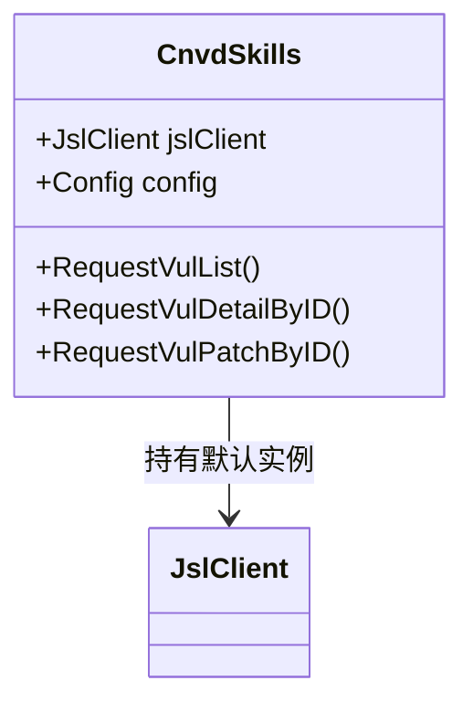

# CnvdSkills 类型

本页说明 cnvd_skills 包的核心类型 CnvdSkills 的结构与职责。

## 类型关系

CnvdSkills 持有默认 JslClient 实例，对外暴露漏洞业务方法。

```mermaid
classDiagram
    class CnvdSkills {
        +JslClient jslClient
        +Config config
        +RequestVulList()
        +RequestVulDetailByID()
        +RequestVulPatchByID()
    }
    class JslClient
    CnvdSkills --> JslClient : 持有默认实例
```

> 本页内容将在后续任务填充。
