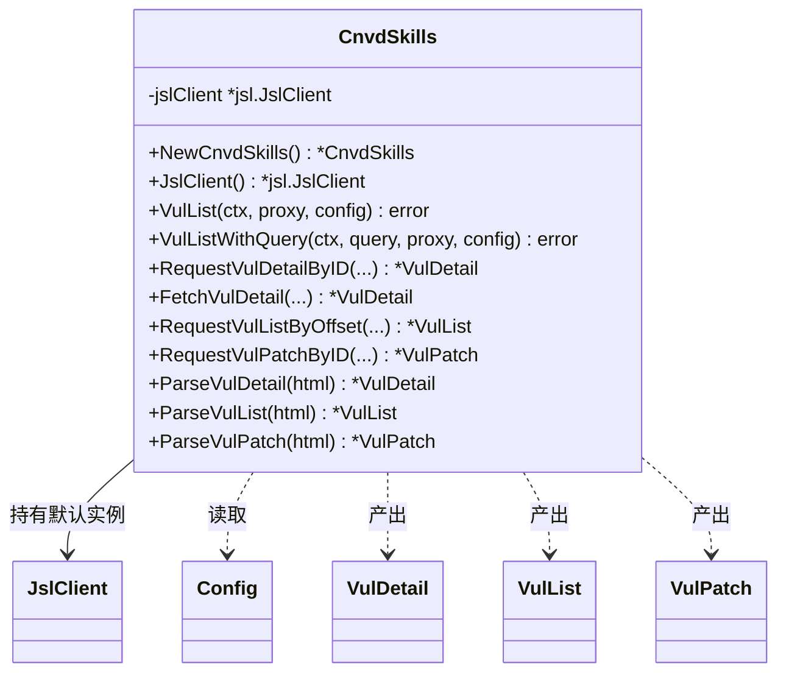

# CnvdSkills 类型

`CnvdSkills` 是 `cnvd_skills` 包的入口类型，持有默认加速乐客户端实例 `jslClient`，对外暴露漏洞列表、详情、补丁的请求与解析方法。

## 类型定义

```go
package cnvd_skills

import "github.com/scagogogo/go-jsl"

type CnvdSkills struct {
    jslClient *jsl.JslClient
}
```

`jslClient` 为未导出字段，外部通过 [`JslClient()`](./methods/new-cnvd-skills) 获取只读引用。

## 构造与访问

| 方法 | 签名 | 说明 |
| --- | --- | --- |
| [`NewCnvdSkills`](./methods/new-cnvd-skills) | `func NewCnvdSkills() *CnvdSkills` | 默认直连、不限时、不配验证码识别器 |
| [`JslClient`](./methods/new-cnvd-skills) | `func (x *CnvdSkills) JslClient() *jsl.JslClient` | 返回持有的默认加速乐客户端（只读） |

## 方法总览

### 列表抓取主流程

| 方法 | 签名 |
| --- | --- |
| [`VulList`](./methods/vul-list-method) | `func (x *CnvdSkills) VulList(ctx context.Context, proxyProvider ProxyProvider, config *Config) error` |
| [`VulListWithQuery`](./methods/vul-list-with-query-method) | `func (x *CnvdSkills) VulListWithQuery(ctx context.Context, query VulListQuery, proxyProvider ProxyProvider, config *Config) error` |

### 详情请求

| 方法 | 签名 |
| --- | --- |
| [`RequestVulDetailByID`](./methods/request-vul-detail) | `func (x *CnvdSkills) RequestVulDetailByID(ctx context.Context, cnvd string, proxyProvider ProxyProvider) (*VulDetail, error)` |
| `RequestVulDetailByIDWithConfig` | `func (x *CnvdSkills) RequestVulDetailByIDWithConfig(ctx context.Context, cnvd string, proxyProvider ProxyProvider, config *Config) (*VulDetail, error)` |
| `RequestVulDetailByURL` | `func (x *CnvdSkills) RequestVulDetailByURL(ctx context.Context, detailPageURL string, proxyProvider ProxyProvider) (*VulDetail, error)` |
| `RequestVulDetailByURLWithConfig` | `func (x *CnvdSkills) RequestVulDetailByURLWithConfig(ctx context.Context, detailPageURL string, proxyProvider ProxyProvider, config *Config) (*VulDetail, error)` |
| [`FetchVulDetail`](./methods/fetch-vul-detail) | `func (x *CnvdSkills) FetchVulDetail(ctx context.Context, cnvd string, proxyProvider ProxyProvider) (*VulDetail, error)` |
| `FetchVulDetailWithConfig` | `func (x *CnvdSkills) FetchVulDetailWithConfig(ctx context.Context, cnvd string, proxyProvider ProxyProvider, config *Config) (*VulDetail, error)` |

### 列表请求

| 方法 | 签名 |
| --- | --- |
| [`RequestVulListByOffset`](./methods/request-vul-list-offset) | `func (x *CnvdSkills) RequestVulListByOffset(ctx context.Context, offset int, proxyProvider ProxyProvider) (*VulList, error)` |
| `RequestVulListByOffsetWithConfig` | `func (x *CnvdSkills) RequestVulListByOffsetWithConfig(ctx context.Context, offset int, proxyProvider ProxyProvider, config *Config) (*VulList, error)` |
| [`RequestVulListByQuery`](./methods/request-vul-list-query) | `func (x *CnvdSkills) RequestVulListByQuery(ctx context.Context, query VulListQuery, offset int, proxyProvider ProxyProvider) (*VulList, error)` |
| `RequestVulListByQueryWithConfig` | `func (x *CnvdSkills) RequestVulListByQueryWithConfig(ctx context.Context, query VulListQuery, offset int, proxyProvider ProxyProvider, config *Config) (*VulList, error)` |

### 补丁请求

| 方法 | 签名 |
| --- | --- |
| [`RequestVulPatchByID`](./methods/request-vul-patch) | `func (x *CnvdSkills) RequestVulPatchByID(ctx context.Context, patchID string, proxyProvider ProxyProvider) (*VulPatch, error)` |
| `RequestVulPatchByIDWithConfig` | `func (x *CnvdSkills) RequestVulPatchByIDWithConfig(ctx context.Context, patchID string, proxyProvider ProxyProvider, config *Config) (*VulPatch, error)` |
| `RequestVulPatchByURL` | `func (x *CnvdSkills) RequestVulPatchByURL(ctx context.Context, patchPageURL string, proxyProvider ProxyProvider) (*VulPatch, error)` |
| `RequestVulPatchByURLWithConfig` | `func (x *CnvdSkills) RequestVulPatchByURLWithConfig(ctx context.Context, patchPageURL string, proxyProvider ProxyProvider, config *Config) (*VulPatch, error)` |

### 解析（离线，不依赖网络）

| 方法 | 签名 |
| --- | --- |
| [`ParseVulDetail`](./methods/parse-vul-detail) | `func (x *CnvdSkills) ParseVulDetail(responseString string) (*VulDetail, error)` |
| [`ParseVulList`](./methods/parse-vul-list) | `func (x *CnvdSkills) ParseVulList(responseBody string) (*VulList, error)` |
| [`ParseVulPatch`](./methods/parse-vul-patch) | `func (x *CnvdSkills) ParseVulPatch(responseString string) (*VulPatch, error)` |

WithConfig 模式详见 [WithConfig 对照](./withconfig-variants)。

## 类图



## 最小示例

```go
package main

import (
    "context"
    "fmt"

    "github.com/scagogogo/cnvd-skills/cnvd_skills"
)

func main() {
    x := cnvd_skills.NewCnvdSkills()
    detail, err := x.FetchVulDetail(context.Background(), "CNVD-2021-67823", cnvd_skills.FixedProxyProvider(""))
    if err != nil {
        fmt.Println(err)
        return
    }
    fmt.Println(detail.CNVD, detail.Product)
}
```

更多示例见 [示例集](./examples/basic-vul-list)。
