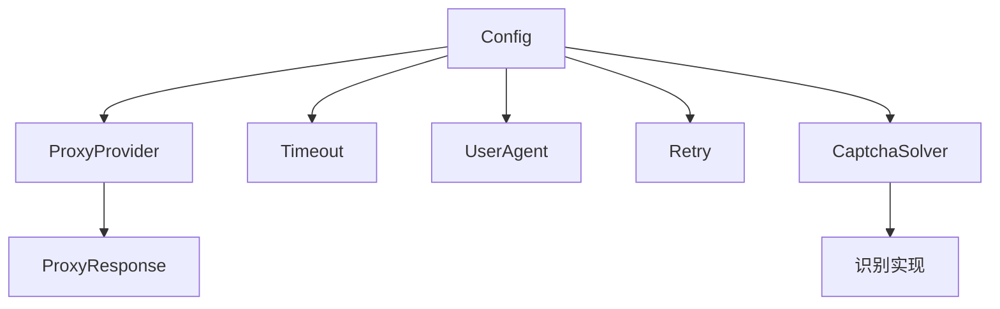

# Config 配置

本页说明 cnvd_skills 的 Config 类型及其各字段如何影响运行行为。

## 字段关系

Config 聚合代理、超时、UA、重试、CaptchaSolver 等可调项。

```mermaid
flowchart TD
    C[Config] --> P[ProxyProvider]
    C --> T[Timeout]
    C --> U[UserAgent]
    C --> R[Retry]
    C --> S[CaptchaSolver]
    P --> PR[ProxyResponse]
    S --> SOL[识别实现]
```

> 本页内容将在后续任务填充。
