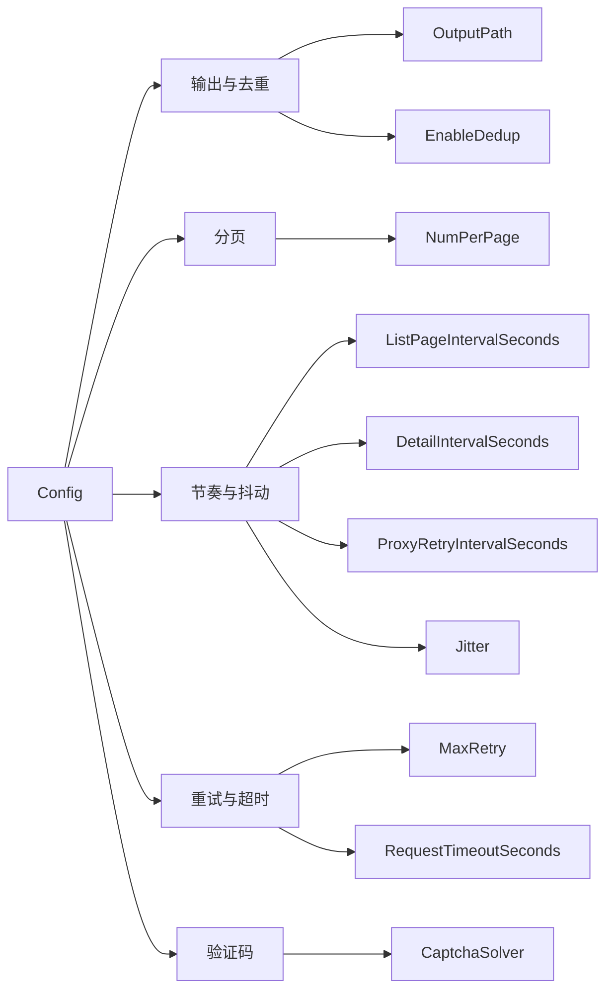

# Config 类型

`Config` 是抓取配置，控制输出路径、分页大小、请求节奏、重试与去重。

## 类型定义

```go
package cnvd_skills

import "github.com/scagogogo/go-jsl"

type Config struct {
    OutputPath                string
    NumPerPage                int
    ListPageIntervalSeconds   int
    DetailIntervalSeconds     int
    ProxyRetryIntervalSeconds int
    MaxRetry                  int
    RequestTimeoutSeconds     int
    EnableDedup               bool
    Jitter                    float64
    CaptchaSolver             jsl.CaptchaSolver
}
```

`CaptchaSolver` 字段类型来自 `go-jsl` 包（`jsl.CaptchaSolver`），cnvd_skills 包本身不定义该类型。

## 字段表

| 字段 | 类型 | 默认 | 用途 |
| --- | --- | --- | --- |
| [`OutputPath`](./types/config-output) | `string` | `data/test.jsonl` | 抓取结果输出文件路径 |
| [`NumPerPage`](./types/config-pagination) | `int` | `10` | 每页漏洞条目数（CNVD 固定 10） |
| [`ListPageIntervalSeconds`](./types/config-intervals) | `int` | `3` | 列表翻页休眠时长（秒） |
| [`DetailIntervalSeconds`](./types/config-intervals) | `int` | `3` | 详情请求休眠时长（秒） |
| [`ProxyRetryIntervalSeconds`](./types/config-intervals) | `int` | `3` | 代理失效后重试前休眠（秒） |
| [`MaxRetry`](./types/config-retry) | `int` | `3` | 单次请求最大重试次数（0=不重试） |
| [`RequestTimeoutSeconds`](./types/config-retry) | `int` | `30` | 单次请求超时（秒，0=不限） |
| [`EnableDedup`](./types/config-dedup) | `bool` | `true` | 按 CNVD-ID 去重 |
| [`Jitter`](./types/config-jitter) | `float64` | `0.3` | 间隔随机抖动幅度（0~1） |
| [`CaptchaSolver`](./types/config-captcha-solver) | `jsl.CaptchaSolver` | `nil` | 验证码识别器 |

## DefaultConfig

```go
func DefaultConfig() *Config
```

返回带默认值的 `*Config`：

```go
&Config{
    OutputPath:                "data/test.jsonl",
    NumPerPage:                10,
    ListPageIntervalSeconds:   3,
    DetailIntervalSeconds:     3,
    ProxyRetryIntervalSeconds: 3,
    MaxRetry:                  3,
    RequestTimeoutSeconds:     30,
    EnableDedup:               true,
    Jitter:                    0.3,
}
```

`CaptchaSolver` 默认为零值 `nil`，遇加速乐图片验证码挑战时返回 `jsl.ErrCaptchaRequired`。详见 [go-jsl 错误变量](../api-gojsl/errors) 与 [CaptchaSolver](../api-gojsl/captcha-solver)。

## 字段关系



## 示例

```go
package main

import (
    "context"

    "github.com/scagogogo/cnvd-skills/cnvd_skills"
)

func main() {
    cfg := cnvd_skills.DefaultConfig()
    cfg.OutputPath = "data/cnvd.jsonl"
    cfg.EnableDedup = true
    cfg.Jitter = 0.5

    x := cnvd_skills.NewCnvdSkills()
    _ = x.VulList(context.Background(), cnvd_skills.FixedProxyProvider(""), cfg)
}
```
