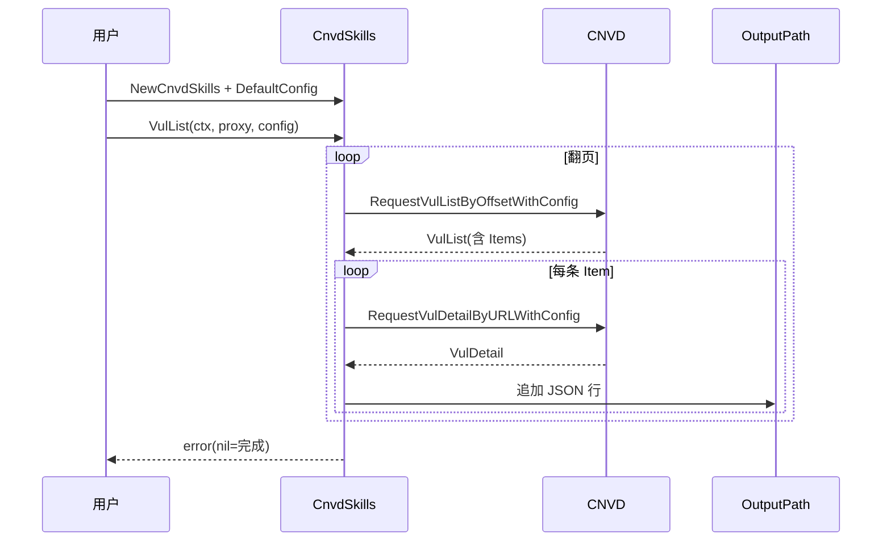

# 基础列表抓取示例

使用 `CnvdSkills.VulList` 全量翻页抓取 CNVD 漏洞列表，逐条抓详情并落盘 JSONL。

## 流程



## 完整代码

```go
package main

import (
    "context"
    "log"

    "github.com/scagogogo/cnvd-skills/cnvd_skills"
)

func main() {
    x := cnvd_skills.NewCnvdSkills()
    cfg := cnvd_skills.DefaultConfig()
    cfg.OutputPath = "data/cnvd.jsonl"
    cfg.EnableDedup = true
    cfg.Jitter = 0.3

    // 直连（空代理）。生产环境改用 PinYiProxyProvider 或 FixedProxyProvider
    err := x.VulList(context.Background(), cnvd_skills.FixedProxyProvider(""), cfg)
    if err != nil {
        log.Fatal(err)
    }
}
```

## 输出格式

`data/cnvd.jsonl` 每行一条 `VulDetail` JSON：

```json
{"URL":"https://www.cnvd.org.cn/flaw/show/CNVD-2021-67823","CNVD":"CNVD-2021-67823","CVE":"CVE-2021-44228",...}
```

`EnableDedup=true` 时，每条详情抓取前先读输出文件，已存在的 CNVD-ID 跳过，详见 [去重续抓](./dedup-resume)。

## 终止条件

- 列表页条目数为 0：打印「当前页无漏洞条目，抓取完成」并返回。
- `list.TotalPage != nil` 且 `page >= *list.TotalPage`：到达最后一页。
- `ctx` 被取消：立即返回 `ctx.Err()`。

## 相关

- 方法详解：[VulList 主流程](../methods/vul-list-method)
- 检索版：[关键词检索](./search-by-keyword)
- 断点续抓：[去重续抓](./dedup-resume)
