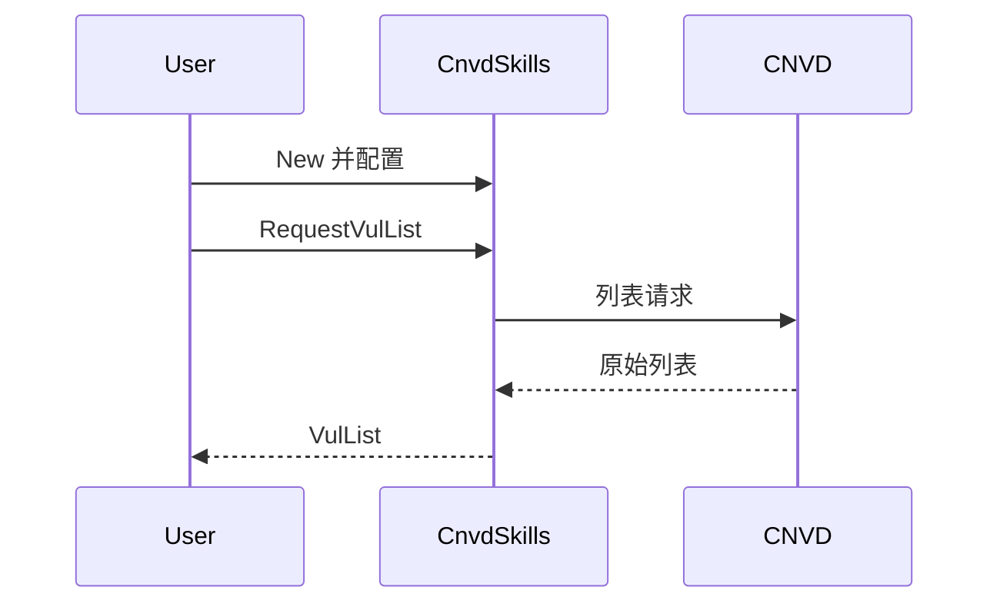

# 基础列表抓取示例

本页演示使用 CnvdSkills 抓取漏洞列表的最小示例。

## 抓取时序

从初始化 CnvdSkills 到拿到列表结果的最短路径。

```mermaid
sequenceDiagram
    participant User
    participant CnvdSkills
    participant CNVD
    User->>CnvdSkills: New 并配置
    User->>CnvdSkills: RequestVulList
    CnvdSkills->>CNVD: 列表请求
    CNVD-->>CnvdSkills: 原始列表
    CnvdSkills-->>User: VulList
```

> 本页内容将在后续任务填充。
