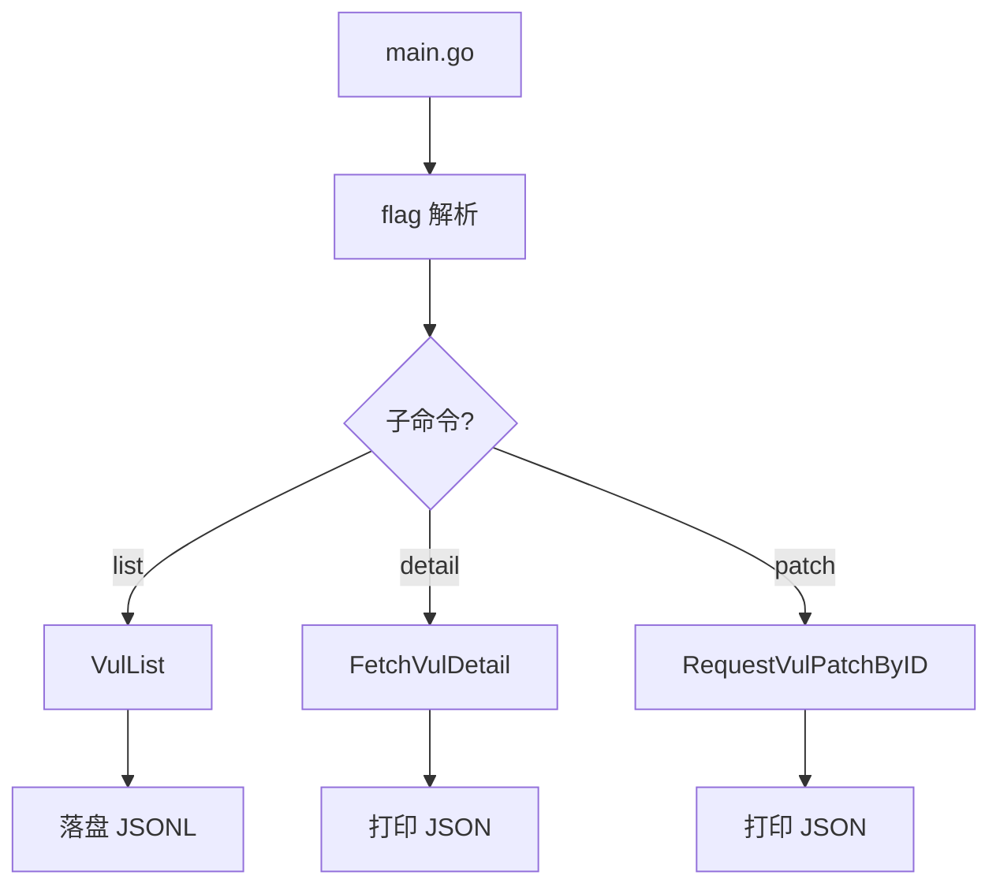

# CLI 封装示例

将 `cnvd_skills` 封装为命令行工具，支持子命令与配置参数。

## 流程



## 完整代码

```go
package main

import (
    "context"
    "encoding/json"
    "flag"
    "fmt"
    "log"
    "os"
    "time"

    "github.com/scagogogo/cnvd-skills/cnvd_skills"
)

func main() {
    if len(os.Args) < 2 {
        usage()
        os.Exit(1)
    }
    ctx, cancel := context.WithTimeout(context.Background(), 30*time.Minute)
    defer cancel()

    x := cnvd_skills.NewCnvdSkills()
    proxy := cnvd_skills.FixedProxyProvider("") // 直连

    switch os.Args[1] {
    case "list":
        listCmd(ctx, x, proxy, os.Args[2:])
    case "detail":
        detailCmd(ctx, x, proxy, os.Args[2:])
    case "patch":
        patchCmd(ctx, x, proxy, os.Args[2:])
    default:
        usage()
        os.Exit(1)
    }
}

func listCmd(ctx context.Context, x *cnvd_skills.CnvdSkills, proxy cnvd_skills.ProxyProvider, args []string) {
    fs := flag.NewFlagSet("list", flag.ExitOnError)
    out := fs.String("o", "data/cnvd.jsonl", "输出路径")
    keyword := fs.String("k", "", "关键词")
    start := fs.String("start", "", "起始日期")
    end := fs.String("end", "", "截止日期")
    _ = fs.Parse(args)

    cfg := cnvd_skills.DefaultConfig()
    cfg.OutputPath = *out

    q := cnvd_skills.VulListQuery{
        Keyword:   *keyword,
        StartDate: *start,
        Endate:    *end,
    }
    if err := x.VulListWithQuery(ctx, q, proxy, cfg); err != nil {
        log.Fatal(err)
    }
}

func detailCmd(ctx context.Context, x *cnvd_skills.CnvdSkills, proxy cnvd_skills.ProxyProvider, args []string) {
    fs := flag.NewFlagSet("detail", flag.ExitOnError)
    cnvd := fs.String("id", "", "CNVD-ID")
    _ = fs.Parse(args)
    if *cnvd == "" {
        log.Fatal("需要 -id")
    }
    d, err := x.FetchVulDetail(ctx, *cnvd, proxy)
    if err != nil {
        log.Fatal(err)
    }
    b, _ := json.MarshalIndent(d, "", "  ")
    fmt.Println(string(b))
}

func patchCmd(ctx context.Context, x *cnvd_skills.CnvdSkills, proxy cnvd_skills.ProxyProvider, args []string) {
    fs := flag.NewFlagSet("patch", flag.ExitOnError)
    id := fs.String("id", "", "补丁 ID")
    _ = fs.Parse(args)
    if *id == "" {
        log.Fatal("需要 -id")
    }
    p, err := x.RequestVulPatchByID(ctx, *id, proxy)
    if err != nil {
        log.Fatal(err)
    }
    b, _ := json.MarshalIndent(p, "", "  ")
    fmt.Println(string(b))
}

func usage() {
    fmt.Fprintln(os.Stderr, "用法: cnvd-skills <list|detail|patch> [flags]")
}
```

## 使用

```bash
# 全量列表抓取到 data/cnvd.jsonl
go run . list

# 关键词检索
go run . list -k Apache -o data/apache.jsonl

# 日期范围
go run . list -start 2024-01-01 -end 2024-06-30

# 单条详情（打印 JSON）
go run . detail -id CNVD-2021-67823

# 补丁
go run . patch -id 289241
```

## 相关

- 主流程：[VulList](../methods/vul-list-method)、[VulListWithQuery](../methods/vul-list-with-query-method)
- 详情：[FetchVulDetail](../methods/fetch-vul-detail)
- 补丁：[RequestVulPatch](../methods/request-vul-patch)
