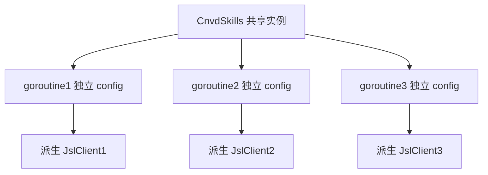

# 并发抓取示例

每请求派生独立 `JslClient`，多 goroutine 各传独立 `config` 互不干扰。

## 并发安全原理

`requestWithRetry` 内每次尝试 `jsl.NewJslClient(proxy, timeoutSec, solver)` 派生新实例，不修改 `CnvdSkills` 持有的共享默认 `jslClient`。多 goroutine 同时调用 WithConfig 方法安全。



## 完整代码

```go
package main

import (
    "context"
    "fmt"
    "sync"

    "github.com/scagogogo/cnvd-skills/cnvd_skills"
)

func main() {
    ctx := context.Background()
    x := cnvd_skills.NewCnvdSkills()
    proxy := cnvd_skills.FixedProxyProvider("")

    cnvds := []string{
        "CNVD-2021-67823",
        "CNVD-2021-12345",
        "CNVD-2022-67890",
    }

    var wg sync.WaitGroup
    results := make([]*cnvd_skills.VulDetail, len(cnvds))
    errs := make([]error, len(cnvds))

    for i, id := range cnvds {
        wg.Add(1)
        go func(idx int, cnvdID string) {
            defer wg.Done()
            // 每请求独立 config
            cfg := cnvd_skills.DefaultConfig()
            cfg.RequestTimeoutSeconds = 60
            d, err := x.FetchVulDetailWithConfig(ctx, cnvdID, proxy, cfg)
            results[idx] = d
            errs[idx] = err
        }(i, id)
    }
    wg.Wait()

    for i := range cnvds {
        if errs[i] != nil {
            fmt.Println(cnvds[i], "error:", errs[i])
            continue
        }
        fmt.Println(cnvds[i], results[i].CVE)
    }
}
```

## 注意事项

- 共享 `*CnvdSkills` 实例安全，但 `*Config` 若被并发修改则不安全。每 goroutine 用独立 `cfg`（或只读共享 `cfg`）。
- 落盘写文件（`VulList` 主流程）非并发安全，不要多 goroutine 同时跑 `VulList` 写同一 `OutputPath`。并发抓单条详情自行管理落盘。
- 代理 API（品易）有调用频率限制，并发下建议自建代理池或降低并发度。

## 并发列表翻页

```go
// 不要这样并发写同一文件
// go x.VulList(ctx, p1, cfg)  // OutputPath 冲突
// go x.VulList(ctx, p2, cfg)
```

正确做法：串行 `VulList`，或并发 `FetchVulDetailWithConfig` 后自行合并写入。

## 相关

- 模式：[WithConfig 模式总览](../methods/withconfig-overview)
- 方法：[FetchVulDetail](../methods/fetch-vul-detail)
- 单条：[单条详情](./single-detail)
