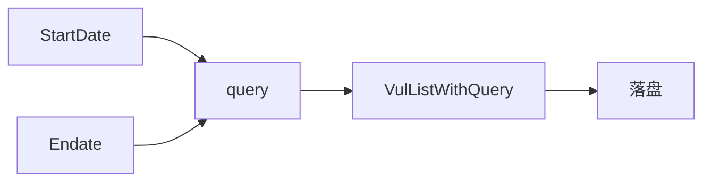

# 日期范围检索示例

按公开日期区间检索漏洞并落盘。

## 流程



## 完整代码

```go
package main

import (
    "context"
    "log"

    "github.com/scagogogo/cnvd-skills/cnvd_skills"
)

func main() {
    ctx := context.Background()
    x := cnvd_skills.NewCnvdSkills()

    q := cnvd_skills.VulListQuery{
        StartDate: "2024-01-01",
        Endate:    "2024-06-30",
    }
    cfg := cnvd_skills.DefaultConfig()
    cfg.OutputPath = "data/2024-h1.jsonl"

    if err := x.VulListWithQuery(ctx, q, cnvd_skills.FixedProxyProvider(""), cfg); err != nil {
        log.Fatal(err)
    }
}
```

## Endate 命名说明

字段名是 `Endate`（非 `EndDate`）：CNVD 表单字段为 `endDate`，Go 字段名避开与内置冲突，`buildQueryURL` 内部映射为 `endDate`。详见 [日期字段](../types/vul-list-query-date)。

## 日期格式

`YYYY-MM-DD`（Go layout `2006-01-02`）。传入格式错误时 CNVD 端按默认（无过滤）处理，库不校验。

## 组合检索

日期可与关键词、CNVD-ID 等组合：

```go
q := cnvd_skills.VulListQuery{
    Keyword:   "Apache",
    StartDate: "2024-01-01",
    Endate:    "2024-06-30",
    Serverity: "2",
}
```

## 相关

- 方法详解：[VulListWithQuery](../methods/vul-list-with-query-method)
- 字段：[日期字段](../types/vul-list-query-date)
- 关键词：[关键词检索](./search-by-keyword)
