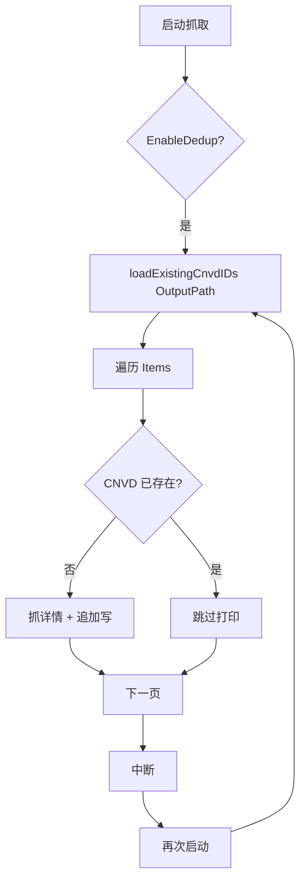

# 去重续抓示例

利用 `EnableDedup` + `OutputPath` 实现断点续抓。

## 流程



## 续抓原理

`fetchAndSaveDetail` 每条详情抓取前：

1. `EnableDedup==true` 时读 `OutputPath` 文件，提取已有 CNVD-ID 集合。
2. 从 `item.Href` 提取 CNVD-ID。
3. 已存在则跳过，不重复请求。

因此抓取中断后重启，已落盘条目自动跳过，从断点继续。

## 完整代码

```go
package main

import (
    "context"
    "log"

    "github.com/scagogogo/cnvd-skills/cnvd_skills"
)

func main() {
    ctx := context.Background()
    x := cnvd_skills.NewCnvdSkills()

    cfg := cnvd_skills.DefaultConfig()
    cfg.OutputPath = "data/cnvd.jsonl"
    cfg.EnableDedup = true  // 续抓关键
    cfg.MaxRetry = 5

    // 第一次运行：全量抓取（可中途 Ctrl-C）
    // 第二次运行：自动跳过已抓条目
    if err := x.VulList(ctx, cnvd_skills.FixedProxyProvider(""), cfg); err != nil {
        log.Fatal(err)
    }
}
```

## loadExistingCnvdIDs

逐行解析 JSONL，提取 `CNVD` 字段：

```go
var record struct {
    CNVD string `json:"CNVD"`
}
```

文件不存在时返回空集合，首次抓取自然全量写入。

## extractCnvdIDFromHref

从列表项相对链接提取 CNVD-ID：

```
/flaw/show/CNVD-2021-67823  →  CNVD-2021-67823
```

详见 [EnableDedup 字段](../types/config-dedup)。

## 关闭去重

`EnableDedup=false` 时强制重抓所有条目（会重复写入）：

```go
cfg.EnableDedup = false
```

## 相关

- 字段：[EnableDedup](../types/config-dedup)、[OutputPath](../types/config-output)
- 主流程：[VulList](../methods/vul-list-method)
- 基础：[基础列表抓取](./basic-vul-list)
