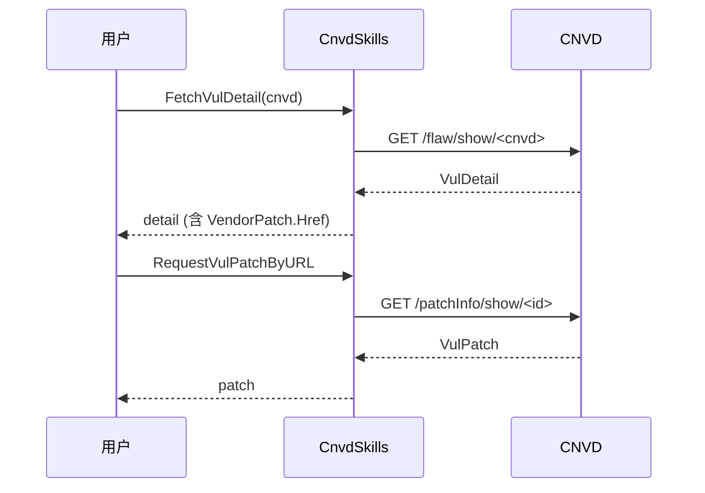

# 补丁抓取示例

从漏洞详情提取补丁链接，抓取结构化补丁信息。

## 流程



## 完整代码

```go
package main

import (
    "context"
    "fmt"
    "log"

    "github.com/scagogogo/cnvd-skills/cnvd_skills"
)

func main() {
    ctx := context.Background()
    x := cnvd_skills.NewCnvdSkills()
    proxy := cnvd_skills.FixedProxyProvider("")

    // 1. 抓详情拿到补丁链接
    d, err := x.FetchVulDetail(ctx, "CNVD-2021-67823", proxy)
    if err != nil {
        log.Fatal(err)
    }
    if d.VendorPatch == nil {
        log.Fatal("无厂商补丁")
    }

    // 2. 拼接补丁详情页 URL
    patchURL := "https://www.cnvd.org.cn" + d.VendorPatch.Href

    // 3. 抓补丁详情
    p, err := x.RequestVulPatchByURL(ctx, patchURL, proxy)
    if err != nil {
        log.Fatal(err)
    }
    fmt.Printf("补丁: %s\n厂商: %s\n链接: %s\n", p.Name, p.Vendor, p.Link)
}
```

## 直接按 patchID 抓取

已知补丁 ID 时跳过详情步骤：

```go
p, err := x.RequestVulPatchByID(ctx, "289241", proxy)
```

`RequestVulPatchByID` 内部拼 `https://www.cnvd.org.cn/patchInfo/show/<patchID>`。

## Link 字段

`VulPatch.Link` 优先取 `补丁链接` 单元格的 `a[href]`，无则退化为纯文本。详见 [VulPatch 字段](../types/vul-patch-fields)。

## 相关

- 方法详解：[RequestVulPatch](../methods/request-vul-patch)
- 详情字段：[厂商补丁](../types/vul-detail-vendor-patch)
- 单条详情：[单条详情](./single-detail)
