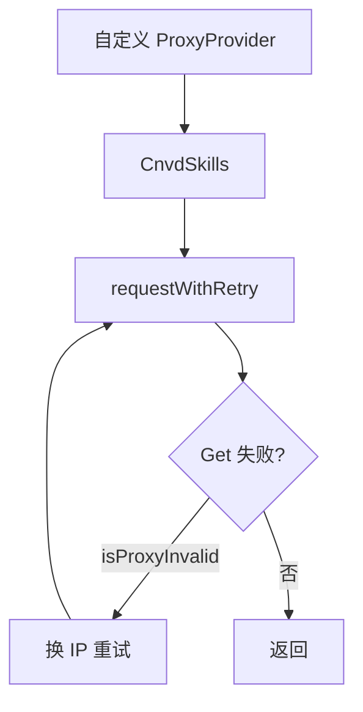

# 代理轮换示例

自定义 `ProxyProvider` 实现代理池轮换与失效切换。

## 流程



## 自定义 ProxyProvider

```go
package main

import (
    "context"
    "log"
    "sync/atomic"
    "time"

    "github.com/scagogogo/cnvd-skills/cnvd_skills"
)

// 轮询代理池
type roundRobin struct {
    pool []string
    idx  uint64
}

func (r *roundRobin) next() (string, error) {
    i := atomic.AddUint64(&r.idx, 1)
    return r.pool[int(i)%len(r.pool)], nil
}

func main() {
    ctx := context.Background()
    x := cnvd_skills.NewCnvdSkills()

    rr := &roundRobin{
        pool: []string{
            "http://1.1.1.1:8080",
            "http://2.2.2.2:8080",
            "http://3.3.3.3:8080",
        },
    }
    provider := cnvd_skills.ProxyProvider(rr.next)

    cfg := cnvd_skills.DefaultConfig()
    cfg.OutputPath = "data/rotated.jsonl"
    cfg.MaxRetry = 5
    cfg.ProxyRetryIntervalSeconds = 5

    if err := x.VulList(ctx, provider, cfg); err != nil {
        log.Fatal(err)
    }
    _ = time.Second
}
```

## 内置实现

- [`FixedProxyProvider`](../methods/fixed-proxy-provider)：固定单一代理。
- [`PinYiProxyProvider`](../methods/pinyi-proxy-provider)：调用品易 API 每次拉新 IP。

## isProxyInvalid 判定

以下错误归类为代理错误，触发换 IP 重试：

- `read tcp ` 前缀、`unexpected EOF` 后缀
- 含 `proxyconnect` / `EOF` / `connection refused` / `i/o timeout` / `context deadline exceeded`

验证码错误（`jsl.ErrCaptchaRequired`）不归类为代理错误，直接返回。

## 组合品易

```go
provider := cnvd_skills.PinYiProxyProvider // 函数本身符合签名
err := x.VulList(ctx, provider, cfg)
```

## 相关

- 类型：[ProxyProvider](../types/proxy-provider-type)
- 内置：[FixedProxyProvider](../methods/fixed-proxy-provider)、[PinYiProxyProvider](../methods/pinyi-proxy-provider)
