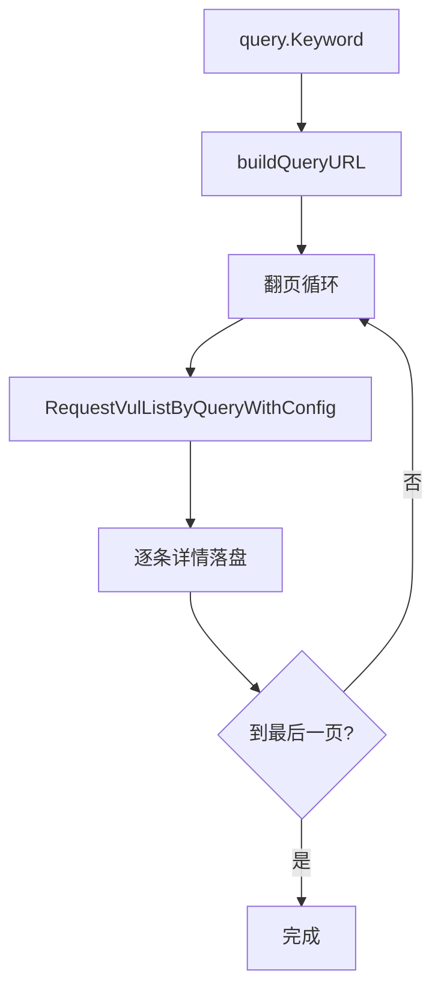

# 关键词检索示例

使用 `VulListWithQuery` 按关键词翻页抓取并落盘。

## 流程



## 完整代码

```go
package main

import (
    "context"
    "log"

    "github.com/scagogogo/cnvd-skills/cnvd_skills"
)

func main() {
    ctx := context.Background()
    x := cnvd_skills.NewCnvdSkills()

    q := cnvd_skills.VulListQuery{
        Keyword:     "Apache Log4j",
        KeywordFlag: 1, // 1=OR
    }
    cfg := cnvd_skills.DefaultConfig()
    cfg.OutputPath = "data/keyword-log4j.jsonl"
    cfg.EnableDedup = true

    if err := x.VulListWithQuery(ctx, q, cnvd_skills.FixedProxyProvider(""), cfg); err != nil {
        log.Fatal(err)
    }
}
```

## KeywordFlag 说明

- `0`（默认）= AND：所有关键词必须同时匹配。
- `1` = OR：任一关键词匹配即可。

`buildQueryURL` 仅在 `Keyword != ""` 时拼入 `keyword` 与 `keywordFlag` 参数。详见 [KeywordFlag](../types/vul-list-query-flags)。

## 单页调试

只想拿一页结果不落盘时用 `RequestVulListByQuery`：

```go
list, err := x.RequestVulListByQuery(ctx, q, 0, cnvd_skills.FixedProxyProvider(""))
// list.VulListItems 即第一页
```

## 相关

- 方法详解：[VulListWithQuery](../methods/vul-list-with-query-method)、[RequestVulListByQuery](../methods/request-vul-list-query)
- 日期检索：[日期范围](./date-range)
- 基础列表：[基础列表抓取](./basic-vul-list)
