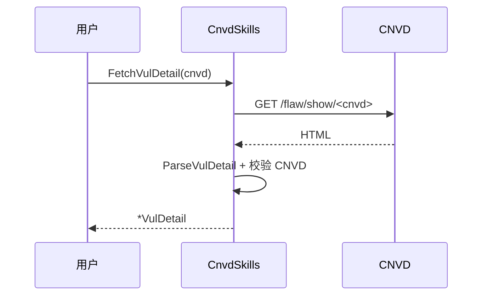

# 单条详情示例

使用 `FetchVulDetail` 抓取单条漏洞详情，结构化返回（不写文件）。

## 流程



## 完整代码

```go
package main

import (
    "context"
    "fmt"
    "log"

    "github.com/scagogogo/cnvd-skills/cnvd_skills"
)

func main() {
    ctx := context.Background()
    x := cnvd_skills.NewCnvdSkills()

    d, err := x.FetchVulDetail(ctx, "CNVD-2021-67823", cnvd_skills.FixedProxyProvider(""))
    if err != nil {
        log.Fatal(err)
    }

    fmt.Printf("CNVD: %s\n", d.CNVD)
    fmt.Printf("CVE:  %s\n", d.CVE)
    fmt.Printf("URL:  %s\n", d.URL)
    fmt.Printf("产品: %s\n", d.Product)
    fmt.Printf("类型: %s\n", d.Category)
    fmt.Printf("描述: %s\n", d.Description)
    fmt.Printf("公开: %s\n", d.PublishTimeStr)
    if d.HazardLevel != nil {
        fmt.Printf("危害: %s (CVSS2=%s)\n", d.HazardLevel.Level, d.HazardLevel.CVSS2)
    }
    if d.VendorPatch != nil {
        fmt.Printf("补丁: %s -> %s\n", d.VendorPatch.Title, d.VendorPatch.Href)
    }
}
```

## 与 VulList 的区别

`VulList` 主流程会落盘 JSONL，`FetchVulDetail` 只返回内存对象，由调用方决定如何持久化：

```go
b, _ := json.Marshal(d)
_ = os.WriteFile("cnvd-"+d.CNVD+".json", b, 0644)
```

## 带验证码识别器

```go
import "github.com/scagogogo/go-jsl"

cfg := cnvd_skills.DefaultConfig()
cfg.CaptchaSolver = jsl.CommandCaptchaSolver("python3", "solve.py")
d, err := x.FetchVulDetailWithConfig(ctx, "CNVD-2021-67823", proxy, cfg)
```

## 相关

- 方法详解：[FetchVulDetail](../methods/fetch-vul-detail)
- 列表抓取：[基础列表抓取](./basic-vul-list)
- 离线解析：[离线解析本地 HTML](./parse-local-html)
