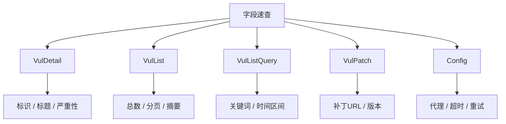

# 字段速查表

本页汇总 cnvd_skills 各类型的常用字段，按分组快速查阅。

## 字段分组

按业务实体分组列出字段，便于快速定位。

```mermaid
graph TD
    F[字段速查] --> D[VulDetail]
    F --> L[VulList]
    F --> Q[VulListQuery]
    F --> P[VulPatch]
    F --> C[Config]
    D --> D1[标识 / 标题 / 严重性]
    L --> L1[总数 / 分页 / 摘要]
    Q --> Q1[关键词 / 时间区间]
    P --> P1[补丁URL / 版本]
    C --> C1[代理 / 超时 / 重试]
```

> 本页内容将在后续任务填充。
