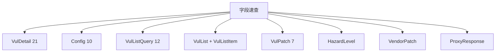

# 字段速查表

按业务实体分组列出 cnvd_skills 各类型的全部字段，便于快速定位。逐项详解见 [字段逐项](./types/vul-detail-fields) 等子页。

## VulDetail（21 字段）

| 字段 | 类型 | 来源 key |
| --- | --- | --- |
| URL | `string` | 调用方 |
| CNVD | `string` | `CNVD-ID` |
| CVE | `string` | `CVE ID` |
| PublishTimeStr | `string` | `公开日期` |
| PublishTime | `*time.Time` | 解析自 `公开日期` |
| HazardLevel | `*HazardLevel` | `危害级别` |
| Product | `string` | `影响产品` |
| Description | `string` | `漏洞描述` |
| Category | `string` | `漏洞类型` |
| Reference | `string` | `参考链接` |
| FixPlan | `string` | `漏洞解决方案` |
| VendorPatchHTML | `string` | `厂商补丁` 原始 HTML |
| VendorPatch | `*VendorPatch` | `厂商补丁` 结构化 |
| Validate | `string` | `验证信息` |
| PostTimeStr / PostTime | `string` / `*time.Time` | `报送时间` |
| RecordTimeStr / RecordTime | `string` / `*time.Time` | `收录时间` |
| UpdateTimeStr / UpdateTime | `string` / `*time.Time` | `更新时间` |
| AttachFile | `string` | `漏洞附件` |

## Config（10 字段）

| 字段 | 类型 | 默认 |
| --- | --- | --- |
| OutputPath | `string` | `data/test.jsonl` |
| NumPerPage | `int` | `10` |
| ListPageIntervalSeconds | `int` | `3` |
| DetailIntervalSeconds | `int` | `3` |
| ProxyRetryIntervalSeconds | `int` | `3` |
| MaxRetry | `int` | `3` |
| RequestTimeoutSeconds | `int` | `30` |
| EnableDedup | `bool` | `true` |
| Jitter | `float64` | `0.3` |
| CaptchaSolver | `jsl.CaptchaSolver` | `nil` |

## VulListQuery（12 字段）

| 字段 | 类型 | URL 参数 |
| --- | --- | --- |
| Keyword | `string` | `keyword` |
| KeywordFlag | `int` | `keywordFlag` |
| StartDate | `string` | `startDate` |
| Endate | `string` | `endDate` |
| CnvdID | `string` | `cnvdId` |
| CnvdIDFlag | `int` | `cnvdIdFlag` |
| CategoryId | `string` | `categoryId` |
| ManufacturerId | `string` | `manufacturerId` |
| Serverity | `string` | `serverity` + `serverityIdStr` |
| ReferenceScope | `int` | `referenceScope` |
| Order | `string` | `order` |
| NumPerPage | `int` | `numPerPage` + `max` |

## VulList / VulListItem

| 字段 | 类型 | 来源 |
| --- | --- | --- |
| Page | `*int` | `span.currentStep` |
| TotalPage | `*int` | `span.totalPage` / `a.step` |
| TotalRecord | `*int` | `span.totalRecord` |
| VulListItems | `[]*VulListItem` | `a[href^='/flaw/show/CNVD-']` |
| Title | `string` | `title` |
| Href | `string` | `href` |

## VulPatch（7 字段）

| 字段 | 类型 | 来源 key |
| --- | --- | --- |
| URL | `string` | 调用方 |
| Name | `string` | `补丁名称` |
| Vendor | `string` | `补丁厂商` |
| Link | `string` | `补丁链接` |
| Description | `string` | `补丁描述` |
| PublishTimeStr / PublishTime | `string` / `*time.Time` | `补丁发布时间` |

## HazardLevel / VendorPatch

| 字段 | 类型 |
| --- | --- |
| HazardLevel.Level | `string` |
| HazardLevel.CVSS2 | `string` |
| VendorPatch.Href | `string` |
| VendorPatch.Title | `string` |

## ProxyResponse

| 字段 | 类型 | JSON |
| --- | --- | --- |
| Code | `int` | `code` |
| Success | `bool` | `success` |
| Msg | `string` | `msg` |
| Data[].IP/Port/ExpireTime/City/Isp | — | 见 [ProxyResponse 字段](./types/proxy-response-fields) |

## 索引图

