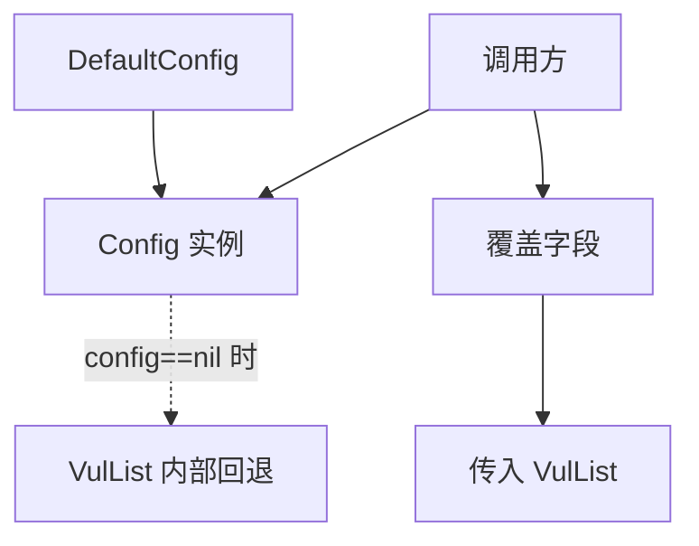

# DefaultConfig

返回带默认值的 `*Config`。

## 签名

```go
func DefaultConfig() *Config
```

## 返回值

```go
&Config{
    OutputPath:                "data/test.jsonl",
    NumPerPage:                10,
    ListPageIntervalSeconds:   3,
    DetailIntervalSeconds:     3,
    ProxyRetryIntervalSeconds: 3,
    MaxRetry:                  3,
    RequestTimeoutSeconds:     30,
    EnableDedup:               true,
    Jitter:                    0.3,
}
```

`CaptchaSolver` 默认为零值 `nil`。

## 用途

- `VulList` / `VulListWithQuery` 在 `config==nil` 时内部回退到 `DefaultConfig()`。
- 调用方以此为基础按需覆盖字段：

```go
cfg := cnvd_skills.DefaultConfig()
cfg.OutputPath = "data/cnvd.jsonl"
cfg.Jitter = 0.5
```



## 字段详解

各字段默认值的含义见 [Config 类型](../config) 与 [字段逐项](../types/vul-detail-fields)（Config 子页）。

## 示例

```go
cfg := cnvd_skills.DefaultConfig()
fmt.Println(cfg.OutputPath, cfg.MaxRetry, cfg.Jitter)
// data/test.jsonl 3 0.3
```
