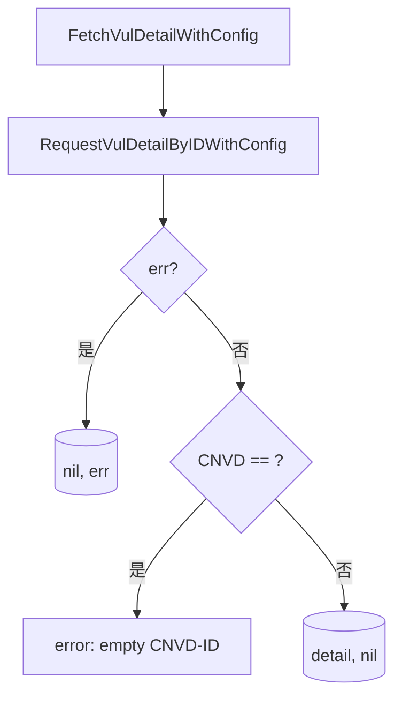

# FetchVulDetail 系列

按 CNVD-ID 抓取单条漏洞详情并返回结构化结果（不写文件），与 `VulList` 主流程的落盘行为解耦。

## 签名

```go
func (x *CnvdSkills) FetchVulDetail(ctx context.Context, cnvd string, proxyProvider ProxyProvider) (*VulDetail, error)
func (x *CnvdSkills) FetchVulDetailWithConfig(ctx context.Context, cnvd string, proxyProvider ProxyProvider, config *Config) (*VulDetail, error)
```

## 参数

| 参数 | 类型 | 说明 |
| --- | --- | --- |
| ctx | `context.Context` | 支持取消 |
| cnvd | `string` | CNVD-ID |
| proxyProvider | `ProxyProvider` | 代理获取函数 |
| config | `*Config` | 仅 WithConfig 版 |

## 实现

`FetchVulDetailWithConfig` 调用 `RequestVulDetailByIDWithConfig` 后校验：

```go
detail, err := x.RequestVulDetailByIDWithConfig(ctx, cnvd, proxyProvider, config)
if err != nil {
    return nil, err
}
if detail.CNVD == "" {
    return nil, fmt.Errorf("parsed detail for %s has empty CNVD-ID", cnvd)
}
return detail, nil
```



## 与 RequestVulDetail 的区别

| 方法 | 落盘 | 校验 CNVD 空 |
| --- | --- | --- |
| RequestVulDetailByIDWithConfig | 否 | 否 |
| FetchVulDetailWithConfig | 否 | 是，空则报错 |

`FetchVulDetail` 适合调用方按需取单条数据并确保数据有效。

## 示例

```go
x := cnvd_skills.NewCnvdSkills()
d, err := x.FetchVulDetail(ctx, "CNVD-2021-67823", cnvd_skills.FixedProxyProvider(""))
if err != nil {
    log.Fatal(err)
}
fmt.Println(d.CNVD, d.CVE, d.Product)
```

详见示例 [单条详情](../examples/single-detail)。
