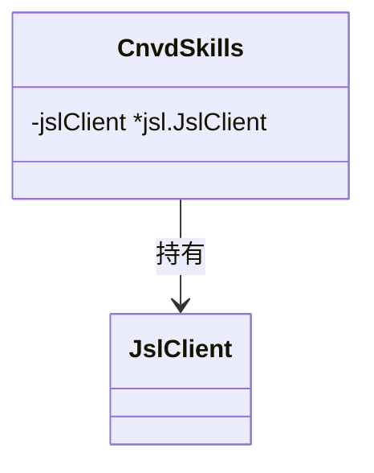

# NewCnvdSkills 与 JslClient

构造 `CnvdSkills` 入口与默认加速乐客户端访问器。

## 签名

```go
func NewCnvdSkills() *CnvdSkills
func (x *CnvdSkills) JslClient() *jsl.JslClient
```

## NewCnvdSkills

构造一个 `CnvdSkills`，默认直连、不限时、不配验证码识别器：

```go
return &CnvdSkills{
    jslClient: jsl.NewJslClient("", 0, nil),
}
```

参数对应：proxy=`""`（直连）、timeout=0（不限）、solver=`nil`（不过验证码）。

## JslClient

返回持有的默认 `*jsl.JslClient`（只读引用）。外部可用它直接访问任意被加速乐保护的 URL：

```go
x := cnvd_skills.NewCnvdSkills()
client := x.JslClient()
body, err := client.Get(ctx, "https://www.cnvd.org.cn/any-protected-url")
```



## 与 WithConfig 的关系

带 `config` 的请求方法在 `requestWithRetry` 内按请求派生独立 `JslClient`（不修改共享实例），保证并发安全。`JslClient()` 返回的是默认实例，仅用于无 config 的简单场景或外部直接调用。

## 示例

```go
package main

import (
    "context"
    "fmt"

    "github.com/scagogogo/cnvd-skills/cnvd_skills"
)

func main() {
    x := cnvd_skills.NewCnvdSkills()
    defer fmt.Println("done")

    // 直接用默认 JslClient 访问受保护 URL
    body, err := x.JslClient().Get(context.Background(), "https://www.cnvd.org.cn/")
    if err != nil {
        fmt.Println(err)
        return
    }
    fmt.Println(len(body), "bytes")
}
```
