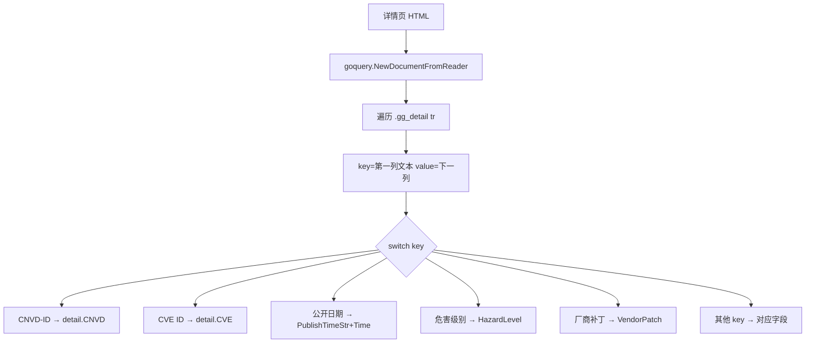

# ParseVulDetail

解析漏洞详情页 HTML，返回结构化 `VulDetail`。不依赖网络，可用本地 fixture 测试。

## 签名

```go
func (x *CnvdSkills) ParseVulDetail(responseString string) (*VulDetail, error)
```

## 参数

| 参数 | 类型 | 说明 |
| --- | --- | --- |
| responseString | `string` | 详情页 HTML 字符串 |

## 返回值

- 成功：`(*VulDetail, nil)`。即便解析不到任何字段也返回空 `VulDetail`（不报错）。
- 失败：`(nil, err)`，仅 `goquery.NewDocumentFromReader` 出错时。

## 解析机制

遍历 `.gg_detail tr`，第一列 `td` 为 key，下一列为 value，`switch key` 分发：



value 经 `decodeHTMLEntities` 解码实体，避免 `&amp;` / `&lt;` 脏数据。

## 与 RequestVulDetail 的关系

`RequestVulDetailByURLWithConfig` 内部调用本方法解析 `requestWithRetry` 返回的 body。离线场景可直接用本方法解析本地保存的 HTML。

## 示例

```go
htmlBytes, _ := os.ReadFile("fixtures/cnvd-2021-67823.html")
x := cnvd_skills.NewCnvdSkills()
d, err := x.ParseVulDetail(string(htmlBytes))
if err != nil { return }
fmt.Println(d.CNVD, d.CVE, d.Product)
```

详见示例 [离线解析本地 HTML](../examples/parse-local-html)。
