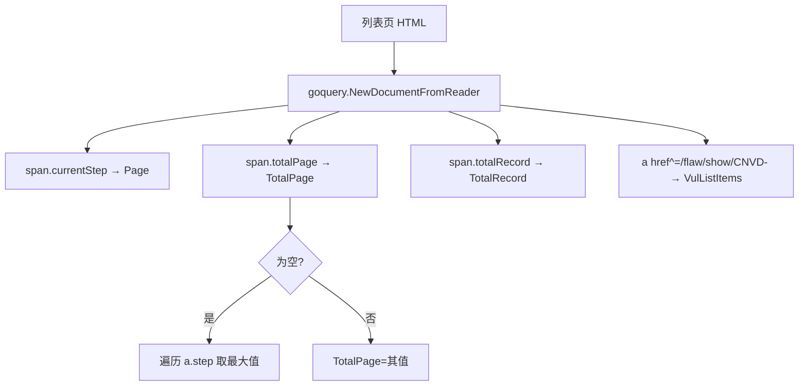

# ParseVulList

解析漏洞列表页 HTML，返回 `VulList`。不依赖网络。

## 签名

```go
func (x *CnvdSkills) ParseVulList(responseBody string) (*VulList, error)
```

## 参数

| 参数 | 类型 | 说明 |
| --- | --- | --- |
| responseBody | `string` | 列表页 HTML 字符串 |

## 返回值

- 成功：`(*VulList, nil)`。
- 失败：`(nil, err)`，仅 `goquery` 解析错误时。

## 解析机制



### TotalPage 双策略

CNVD 真实列表页分页结构为 `span.currentStep` + 多个 `a.step`，最后一个 `a.step` 文本即总页数。代码先取 `span.totalPage`，为空时遍历 `a.step` 取文本数字最大值。

### VulListItems

选择器 `a[href^='/flaw/show/CNVD-']`，取 `title` 与 `href` 属性。

## 与 RequestVulList 的关系

`RequestVulListByOffsetWithConfig` / `RequestVulListByQueryWithConfig` 内部调用本方法解析 body。

## 示例

```go
htmlBytes, _ := os.ReadFile("fixtures/list-page-1.html")
x := cnvd_skills.NewCnvdSkills()
list, err := x.ParseVulList(string(htmlBytes))
if err != nil { return }
fmt.Printf("page=%v total=%v items=%d\n", list.Page, list.TotalPage, len(list.VulListItems))
```
