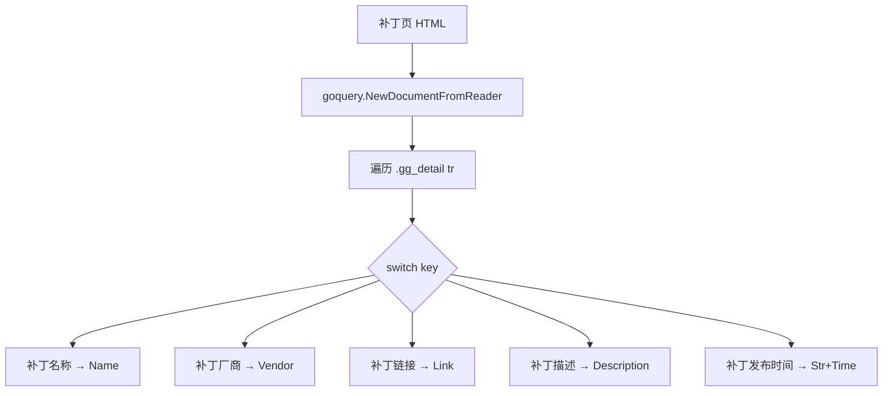

# ParseVulPatch

解析厂商补丁详情页 HTML，返回 `VulPatch`。不依赖网络。

## 签名

```go
func (x *CnvdSkills) ParseVulPatch(responseString string) (*VulPatch, error)
```

## 参数

| 参数 | 类型 | 说明 |
| --- | --- | --- |
| responseString | `string` | 补丁详情页 HTML 字符串 |

## 返回值

- 成功：`(*VulPatch, nil)`。
- 失败：`(nil, err)`，仅 `goquery` 解析错误时。

## 解析机制

遍历 `.gg_detail tr`，`switch key` 分发：

| key | 字段 |
| --- | --- |
| `补丁名称` | `Name` |
| `补丁厂商` | `Vendor` |
| `补丁链接` | `Link`（优先 `a href`，无则文本） |
| `补丁描述` | `Description` |
| `补丁发布时间` | `PublishTimeStr` + `PublishTime` |



value 经 `decodeHTMLEntities` 解码。`PublishTime` 由 `parseCnvdDate` 解析，失败为 `nil`。

## 与 RequestVulPatch 的关系

`RequestVulPatchByURLWithConfig` 内部调用本方法解析 body，并回填 `patch.URL`。

## 示例

```go
htmlBytes, _ := os.ReadFile("fixtures/patch-289241.html")
x := cnvd_skills.NewCnvdSkills()
p, err := x.ParseVulPatch(string(htmlBytes))
if err != nil { return }
fmt.Println(p.Name, p.Vendor, p.Link)
```
