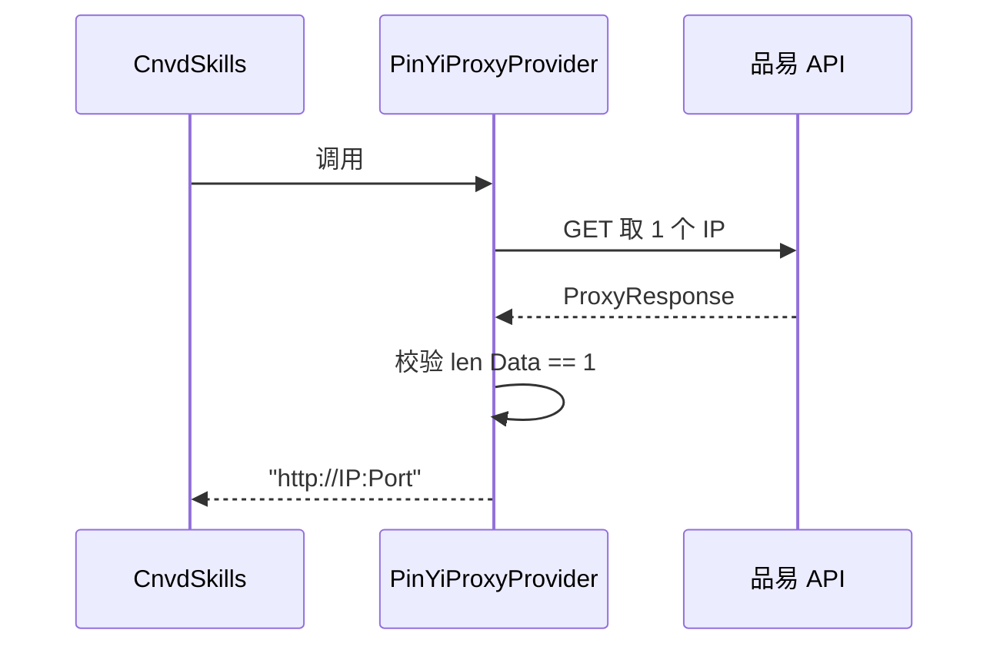

# PinYiProxyProvider

调用品易代理 API 动态获取代理 IP。

## 签名

```go
func PinYiProxyProvider() (string, error)
```

该函数本身符合 `ProxyProvider` 签名，可直接作为 `proxyProvider` 参数传入。

## 返回值

- 成功：`("http://IP:Port", nil)`。
- 失败：`("", err)`，HTTP 错误或 `Data` 条数不为 1 时报错。

## 实现

```go
targetUrl := "http://zltiqu.pyhttp.taolop.com/getip?count=1&neek=75958&type=2&yys=0&port=2&sb=&mr=1&sep=0&ts=1&time=2"
json, err := requests.GetJson[*ProxyResponse](context.Background(), targetUrl)
if err != nil {
    return "", err
}
if len(json.Data) != 1 {
    return "", fmt.Errorf("failed: %#v", json)
}
return fmt.Sprintf("http://%s:%d", json.Data[0].IP, json.Data[0].Port), nil
```



## 用途

生产环境代理轮换：每次请求拉新 IP，降低单一 IP 被风控概率。

## 注意

- API URL 含账号 token（`neek=75958`），实际使用需替换为自有账号。
- 返回 IP 有过期时间（`Data[0].ExpireTime`），过期后失效会触发 `isProxyInvalid` 重试。

## 示例

```go
x := cnvd_skills.NewCnvdSkills()
cfg := cnvd_skills.DefaultConfig()
err := x.VulList(context.Background(), cnvd_skills.PinYiProxyProvider, cfg)
```

详见示例 [代理轮换](../examples/proxy-rotation)。
