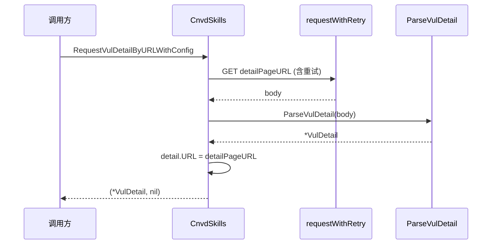

# RequestVulDetail 系列

按 CNVD-ID 或详情页 URL 请求并解析漏洞详情。包含 4 个方法（2 对普通/WithConfig）。

## 签名

```go
func (x *CnvdSkills) RequestVulDetailByID(ctx context.Context, cnvd string, proxyProvider ProxyProvider) (*VulDetail, error)
func (x *CnvdSkills) RequestVulDetailByIDWithConfig(ctx context.Context, cnvd string, proxyProvider ProxyProvider, config *Config) (*VulDetail, error)
func (x *CnvdSkills) RequestVulDetailByURL(ctx context.Context, detailPageURL string, proxyProvider ProxyProvider) (*VulDetail, error)
func (x *CnvdSkills) RequestVulDetailByURLWithConfig(ctx context.Context, detailPageURL string, proxyProvider ProxyProvider, config *Config) (*VulDetail, error)
```

## 参数

| 参数 | 类型 | 说明 |
| --- | --- | --- |
| ctx | `context.Context` | 支持取消 |
| cnvd | `string` | CNVD-ID，如 `CNVD-2021-67823` |
| detailPageURL | `string` | 详情页完整 URL |
| proxyProvider | `ProxyProvider` | 代理获取函数 |
| config | `*Config` | 仅 WithConfig 版，`nil` 退化为单次无重试 |

## URL 构造

`RequestVulDetailByID` 把 `cnvd` 拼为：

```go
targetUrl := "https://www.cnvd.org.cn/flaw/show/" + cnvd
```

然后委托 `RequestVulDetailByURL`。

## 主流程



## 返回值

- 成功：`(*VulDetail, nil)`，`detail.URL` 已回填为请求 URL。
- 失败：`(nil, err)`，`ParseVulDetail` 出错也返回 `(nil, err)`。

## 与 FetchVulDetail 的区别

`RequestVulDetail*` 不校验 `CNVD` 是否为空；[`FetchVulDetail`](./fetch-vul-detail) 会额外校验，空则报错。需要严格保证数据完整时用 `FetchVulDetail`。

## 示例

```go
x := cnvd_skills.NewCnvdSkills()
proxy := cnvd_skills.FixedProxyProvider("")

// 按 ID
d1, err := x.RequestVulDetailByID(ctx, "CNVD-2021-67823", proxy)

// 按 URL，带 config
cfg := cnvd_skills.DefaultConfig()
d2, err := x.RequestVulDetailByURLWithConfig(ctx,
    "https://www.cnvd.org.cn/flaw/show/CNVD-2021-67823", proxy, cfg)
```

WithConfig 模式见 [WithConfig 对照](../withconfig-variants)。
