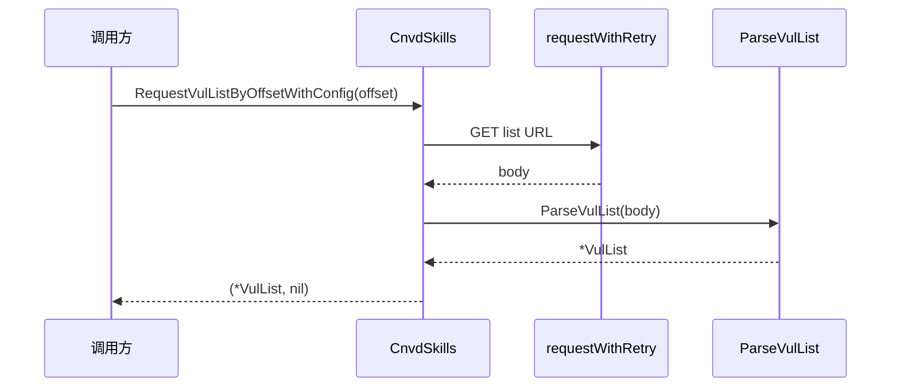

# RequestVulListByOffset 系列

请求指定偏移量的漏洞列表页并解析。

## 签名

```go
func (x *CnvdSkills) RequestVulListByOffset(ctx context.Context, offset int, proxyProvider ProxyProvider) (*VulList, error)
func (x *CnvdSkills) RequestVulListByOffsetWithConfig(ctx context.Context, offset int, proxyProvider ProxyProvider, config *Config) (*VulList, error)
```

## 参数

| 参数 | 类型 | 说明 |
| --- | --- | --- |
| ctx | `context.Context` | 支持取消 |
| offset | `int` | 偏移量，从 0 开始 |
| proxyProvider | `ProxyProvider` | 代理获取函数 |
| config | `*Config` | 仅 WithConfig 版 |

## URL 构造

```go
targetUrl := fmt.Sprintf("https://www.cnvd.org.cn/flaw/list?numPerPage=10&offset=%d&max=10", offset)
```

每页固定 10 条（CNVD 列表页真实固定值）。

## 主流程



## 返回值

- 成功：`(*VulList, nil)`，含 `Page`/`TotalPage`/`TotalRecord`/`VulListItems`。
- 失败：`(nil, err)`，`ParseVulList` 出错也返回 `(nil, err)`。

## 与主流程的关系

`VulList` 主流程内部调用本方法翻页。单页调试或自定义翻页逻辑可直接用本方法。

## 示例

```go
x := cnvd_skills.NewCnvdSkills()
// 抓第 3 页（offset=20）
list, err := x.RequestVulListByOffset(ctx, 20, cnvd_skills.FixedProxyProvider(""))
if err != nil { return }
fmt.Printf("page=%v total=%v items=%d\n", list.Page, list.TotalPage, len(list.VulListItems))
```
