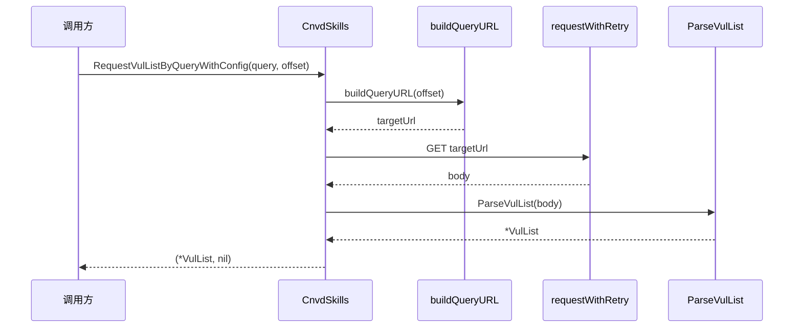

# RequestVulListByQuery 系列

按 `VulListQuery` 检索条件请求列表页并解析。

## 签名

```go
func (x *CnvdSkills) RequestVulListByQuery(ctx context.Context, query VulListQuery, offset int, proxyProvider ProxyProvider) (*VulList, error)
func (x *CnvdSkills) RequestVulListByQueryWithConfig(ctx context.Context, query VulListQuery, offset int, proxyProvider ProxyProvider, config *Config) (*VulList, error)
```

## 参数

| 参数 | 类型 | 说明 |
| --- | --- | --- |
| ctx | `context.Context` | 支持取消 |
| query | `VulListQuery` | 检索条件 |
| offset | `int` | 偏移量，从 0 开始 |
| proxyProvider | `ProxyProvider` | 代理获取函数 |
| config | `*Config` | 仅 WithConfig 版 |

## URL 构造

```go
targetUrl := query.buildQueryURL(offset)
```

`buildQueryURL` 把非空字段拼入 query string，详见 [VulListQuery 字段](../types/vul-list-query-fields)。

## 主流程



## 返回值

- 成功：`(*VulList, nil)`。
- 失败：`(nil, err)`。

## 与主流程的关系

`VulListWithQuery` 主流程内部调用本方法按 query 翻页。

## 示例

```go
q := cnvd_skills.VulListQuery{
    Keyword:   "Apache",
    StartDate: "2024-01-01",
    Endate:    "2024-06-30",
}
x := cnvd_skills.NewCnvdSkills()
list, err := x.RequestVulListByQuery(ctx, q, 0, cnvd_skills.FixedProxyProvider(""))
```

详见示例 [关键词检索](../examples/search-by-keyword)、[日期范围](../examples/date-range)。
