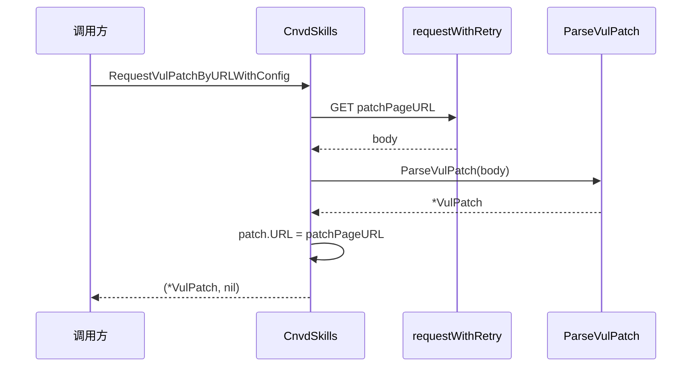

# RequestVulPatch 系列

按补丁 ID 或补丁详情页 URL 请求并解析厂商补丁。包含 4 个方法（2 对普通/WithConfig）。

## 签名

```go
func (x *CnvdSkills) RequestVulPatchByID(ctx context.Context, patchID string, proxyProvider ProxyProvider) (*VulPatch, error)
func (x *CnvdSkills) RequestVulPatchByIDWithConfig(ctx context.Context, patchID string, proxyProvider ProxyProvider, config *Config) (*VulPatch, error)
func (x *CnvdSkills) RequestVulPatchByURL(ctx context.Context, patchPageURL string, proxyProvider ProxyProvider) (*VulPatch, error)
func (x *CnvdSkills) RequestVulPatchByURLWithConfig(ctx context.Context, patchPageURL string, proxyProvider ProxyProvider, config *Config) (*VulPatch, error)
```

## 参数

| 参数 | 类型 | 说明 |
| --- | --- | --- |
| ctx | `context.Context` | 支持取消 |
| patchID | `string` | 补丁 ID，如 `289241` |
| patchPageURL | `string` | 补丁详情页完整 URL |
| proxyProvider | `ProxyProvider` | 代理获取函数 |
| config | `*Config` | 仅 WithConfig 版 |

## URL 构造

```go
targetUrl := "https://www.cnvd.org.cn/patchInfo/show/" + patchID
```

`RequestVulPatchByID` 委托 `RequestVulPatchByURL`。

## 主流程



## 返回值

- 成功：`(*VulPatch, nil)`，`patch.URL` 已回填。
- 失败：`(nil, err)`。

## 获取 patchID

通常从 `VulDetail.VendorPatch.Href`（如 `/patchInfo/show/289241`）提取数字部分。

## 示例

```go
x := cnvd_skills.NewCnvdSkills()
proxy := cnvd_skills.FixedProxyProvider("")

// 按 ID
p1, err := x.RequestVulPatchByID(ctx, "289241", proxy)

// 按 URL
p2, err := x.RequestVulPatchByURL(ctx,
    "https://www.cnvd.org.cn/patchInfo/show/289241", proxy)
```

详见示例 [补丁抓取](../examples/patch-fetch)。
