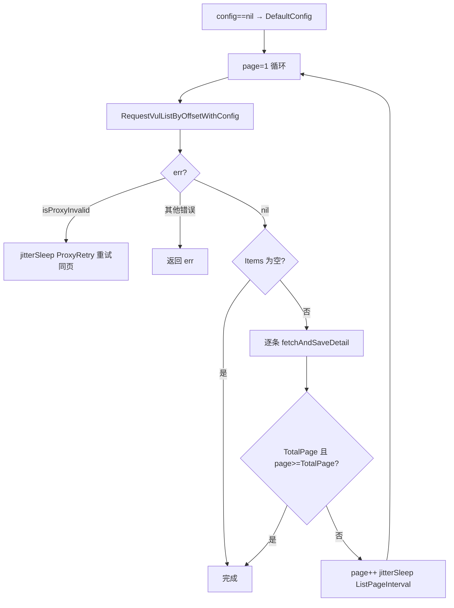

# VulList 主流程

`VulList` 全量翻页抓取 CNVD 漏洞列表，逐条抓详情并落盘 JSONL。

## 签名

```go
func (x *CnvdSkills) VulList(ctx context.Context, proxyProvider ProxyProvider, config *Config) error
```

## 参数

| 参数 | 类型 | 说明 |
| --- | --- | --- |
| ctx | `context.Context` | 支持取消 |
| proxyProvider | `ProxyProvider` | 代理获取函数 |
| config | `*Config` | 抓取配置，`nil` 回退 `DefaultConfig()` |

## 返回值

`error`，`nil` 表示抓取完成。

## 主流程



## 终止条件

1. 列表页条目数为 0：打印「当前页无漏洞条目，抓取完成」返回 `nil`。
2. `list.TotalPage != nil && page >= *list.TotalPage`：打印「已抓取到最后一页」返回 `nil`。
3. `ctx` 取消：返回 `ctx.Err()`。

## fetchAndSaveDetail

单条详情抓取与落盘，含去重：

- `EnableDedup==true`：先读输出文件，已存在 CNVD-ID 跳过。
- 代理失效：换 IP 重试。
- `detail.CNVD==""`（解析异常）：重试。
- 成功后追加 JSONL 并 `jitterSleep(DetailIntervalSeconds)`。

## 示例

```go
x := cnvd_skills.NewCnvdSkills()
cfg := cnvd_skills.DefaultConfig()
cfg.OutputPath = "data/cnvd.jsonl"
err := x.VulList(context.Background(), cnvd_skills.FixedProxyProvider(""), cfg)
```

检索版见 [VulListWithQuery](./vul-list-with-query-method)，最小示例见 [基础列表抓取](../examples/basic-vul-list)。
