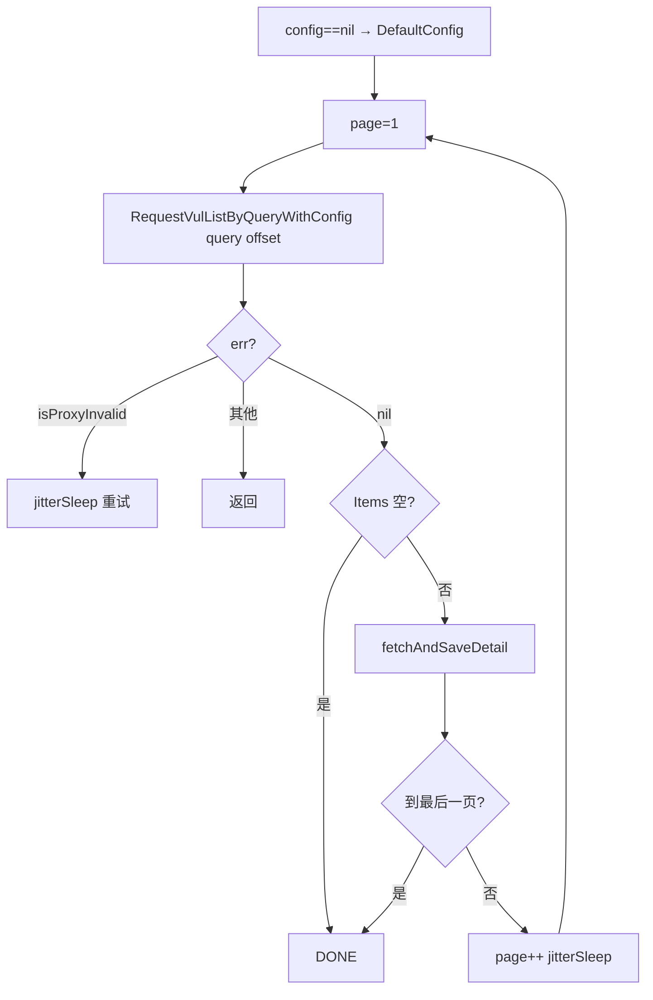

# VulListWithQuery

按检索条件翻页抓取并逐条详情落盘。与 [`VulList`](./vul-list-method) 区别：先按 `query` 过滤再翻页。

## 签名

```go
func (x *CnvdSkills) VulListWithQuery(ctx context.Context, query VulListQuery, proxyProvider ProxyProvider, config *Config) error
```

## 参数

| 参数 | 类型 | 说明 |
| --- | --- | --- |
| ctx | `context.Context` | 支持取消 |
| query | `VulListQuery` | 检索条件，零值等价全量 |
| proxyProvider | `ProxyProvider` | 代理获取函数 |
| config | `*Config` | 抓取配置，`nil` 回退 `DefaultConfig()` |

## 主流程

与 `VulList` 结构一致，仅把 `RequestVulListByOffsetWithConfig` 换成 `RequestVulListByQueryWithConfig`：



## query 零值

`VulListQuery{}` 零值时 `buildQueryURL` 仅拼 `numPerPage/offset/max`，等价于全量抓取，与 `VulList` 行为接近。

## 示例

```go
q := cnvd_skills.VulListQuery{
    Keyword:   "Apache",
    StartDate: "2024-01-01",
    Endate:    "2024-06-30",
}
x := cnvd_skills.NewCnvdSkills()
cfg := cnvd_skills.DefaultConfig()
err := x.VulListWithQuery(context.Background(), q, cnvd_skills.FixedProxyProvider(""), cfg)
```

详见示例 [关键词检索](../examples/search-by-keyword)、[日期范围](../examples/date-range)。
