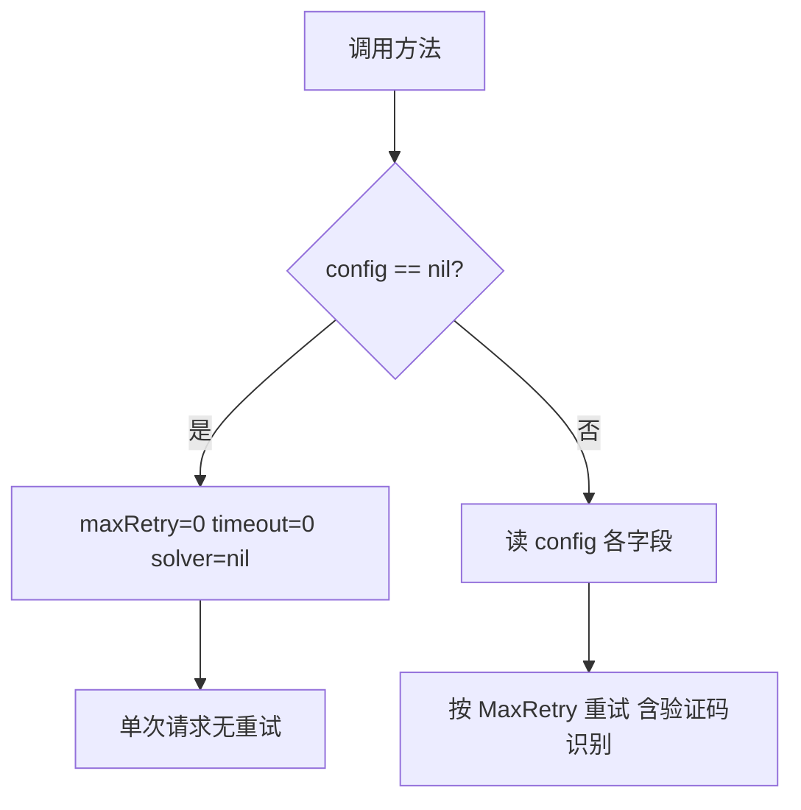

# WithConfig 模式总览

cnvd_skills 的 7 对方法采用「普通版委托 WithConfig 版」模式，`config=nil` 时退化为单次无重试请求。

## 7 对方法

| 普通版 | WithConfig 版 |
| --- | --- |
| `RequestVulDetailByID` | `RequestVulDetailByIDWithConfig` |
| `RequestVulDetailByURL` | `RequestVulDetailByURLWithConfig` |
| `FetchVulDetail` | `FetchVulDetailWithConfig` |
| `RequestVulListByOffset` | `RequestVulListByOffsetWithConfig` |
| `RequestVulListByQuery` | `RequestVulListByQueryWithConfig` |
| `RequestVulPatchByID` | `RequestVulPatchByIDWithConfig` |
| `RequestVulPatchByURL` | `RequestVulPatchByURLWithConfig` |

普通版统一委托：

```go
func (x *CnvdSkills) RequestVulDetailByURL(ctx, detailPageURL, proxyProvider) (*VulDetail, error) {
    return x.RequestVulDetailByURLWithConfig(ctx, detailPageURL, proxyProvider, nil)
}
```

## requestWithRetry 中的 config 分支

```go
maxRetry := 0
timeoutSec := 0
var solver jsl.CaptchaSolver
if config != nil {
    maxRetry = config.MaxRetry
    timeoutSec = config.RequestTimeoutSeconds
    solver = config.CaptchaSolver
}
for attempt := 0; attempt <= maxRetry; attempt++ {
    client := jsl.NewJslClient(proxy, timeoutSec, solver)
    ...
}
```



## 并发安全

每次尝试按当前 config 派生独立 `JslClient`（`jsl.NewJslClient(proxy, timeoutSec, solver)`），不修改 `CnvdSkills` 持有的共享默认实例。多个 goroutine 各自传不同 `config` 互不干扰。

## 主流程方法

`VulList` / `VulListWithQuery` 本身即接收 `config *Config`（无成对变体），`config==nil` 内部回退 `DefaultConfig()`。

## 选择建议

- 一次性脚本：普通版。
- 生产抓取：WithConfig 版 + `CaptchaSolver`。
- 翻页落盘：`VulList` / `VulListWithQuery`。

详见 [WithConfig 对照表](../withconfig-variants) 与示例 [并发抓取](../examples/concurrent-fetch)。
