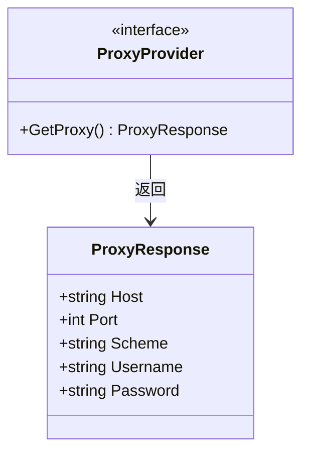

# Proxy 类型

本页说明代理相关类型 ProxyProvider 与 ProxyResponse 的结构与契约。

## 类型关系

ProxyProvider 提供代理地址，ProxyResponse 承载一次代理获取的结果。

```mermaid
classDiagram
    class ProxyProvider {
        <<interface>>
        +GetProxy() ProxyResponse
    }
    class ProxyResponse {
        +string Host
        +int Port
        +string Scheme
        +string Username
        +string Password
    }
    ProxyProvider --> ProxyResponse : 返回
```

> 本页内容将在后续任务填充。
