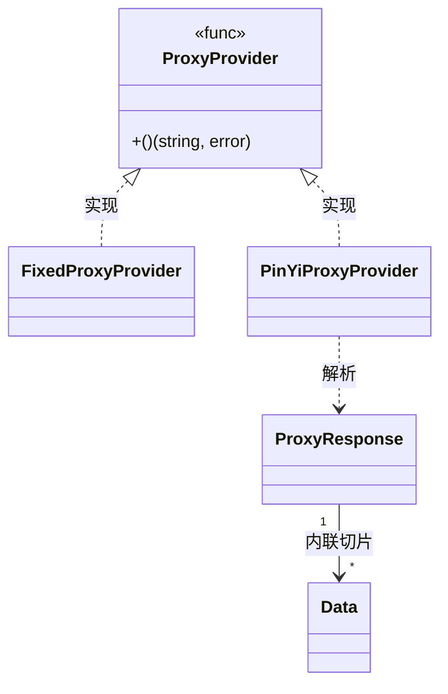

# Proxy 类型

`ProxyProvider` 是返回代理地址的函数类型，`ProxyResponse` 是品易代理 API 的响应结构。

## 类型定义

```go
package cnvd_skills

type ProxyProvider func() (string, error)

type ProxyResponse struct {
    Code    int    `json:"code"`
    Success bool   `json:"success"`
    Msg     string `json:"msg"`
    Data    []struct {
        IP         string `json:"ip"`
        Port       int    `json:"port"`
        ExpireTime string `json:"expire_time"`
        City       string `json:"city"`
        Isp        string `json:"isp"`
    } `json:"data"`
}
```

## 内置实现

| 函数 | 签名 | 详解 |
| --- | --- | --- |
| [`FixedProxyProvider`](./methods/fixed-proxy-provider) | `func FixedProxyProvider(proxy string) ProxyProvider` | 始终返回固定 IP |
| [`PinYiProxyProvider`](./methods/pinyi-proxy-provider) | `func PinYiProxyProvider() (string, error)` | 调用品易 API 拉取新 IP |

## ProxyProvider 契约

- 返回值格式：`http://host:port`（给 `jsl.NewJslClient` 用）。
- 失败返回非空 `error`，调用方按 [`isProxyInvalid`](./types/proxy-provider-type) 判定是否换 IP 重试。
- `FixedProxyProvider("")` 返回空串，等价直连。

## ProxyResponse 字段

| 字段 | 类型 | JSON | 说明 |
| --- | --- | --- | --- |
| Code | `int` | `code` | 业务码 |
| Success | `bool` | `success` | 是否成功 |
| Msg | `string` | `msg` | 提示 |
| Data | `[]struct` | `data` | IP 列表，详见 [ProxyResponse 字段](./types/proxy-response-fields) |

## 关系



## 示例

```go
// 固定代理
x := cnvd_skills.NewCnvdSkills()
_, _ = x.FetchVulDetail(context.Background(), "CNVD-2021-67823",
    cnvd_skills.FixedProxyProvider("http://127.0.0.1:8080"))

// 品易动态代理
_, _ = x.FetchVulDetail(context.Background(), "CNVD-2021-67823",
    cnvd_skills.PinYiProxyProvider)
```
