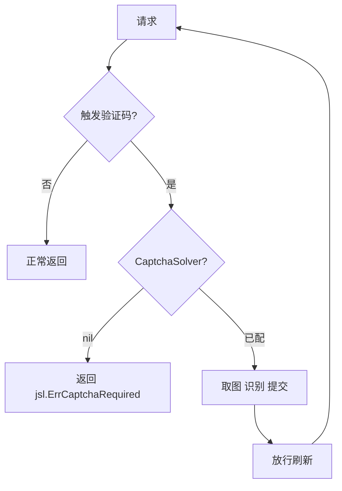

# Config.CaptchaSolver 字段

```go
import "github.com/scagogogo/go-jsl"

CaptchaSolver jsl.CaptchaSolver
```

## 说明

验证码识别器，类型为 `jsl.CaptchaSolver`（来自 `go-jsl` 包，cnvd_skills 包本身不定义该类型）。`DefaultConfig()` 留 `nil`。

## 作用

CNVD 触发图片验证码挑战时：

- 已配置：库自动取图 → 识别 → 提交 → 放行刷新。
- 未配置：返回 `jsl.ErrCaptchaRequired`，调用方需自行处理或配置识别器。

`requestWithRetry` 内遇 `jsl.ErrCaptchaRequired` 不重试，直接返回。



## 内置实现

`go-jsl` 提供 `jsl.CommandCaptchaSolver`（外部命令识别器）等。详见 [go-jsl CaptchaSolver](../../api-gojsl/captcha-solver) 与 [go-jsl 错误变量](../../api-gojsl/errors)。

## 传入方式

`CaptchaSolver` 仅通过 `WithConfig` 系列方法或主流程方法生效：

```go
cfg := cnvd_skills.DefaultConfig()
cfg.CaptchaSolver = solver // jsl.CaptchaSolver 实例

// 带识别器抓详情
d, err := x.RequestVulDetailByIDWithConfig(ctx, "CNVD-2021-67823", proxy, cfg)

// 带识别器翻页
err = x.VulList(ctx, proxy, cfg)
```

普通版方法（如 `RequestVulDetailByID`）内部 `config=nil`，`CaptchaSolver` 不生效，遇验证码即返回错误。

## 示例

```go
import "github.com/scagogogo/go-jsl"

solver := jsl.CommandCaptchaSolver("python3", "solve.py")
cfg := cnvd_skills.DefaultConfig()
cfg.CaptchaSolver = solver
```
