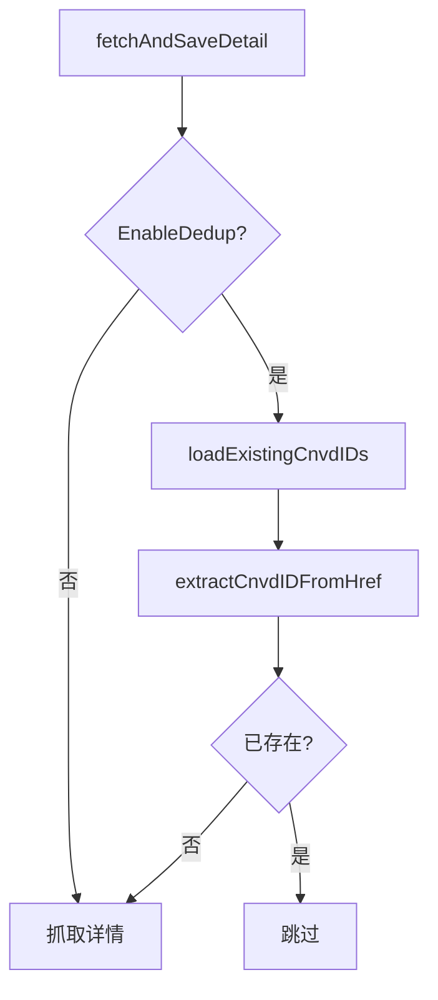

# Config.EnableDedup 字段

```go
EnableDedup bool
```

## 说明

是否对输出文件按 CNVD-ID 去重。`DefaultConfig()` 设为 `true`。

## 机制

`fetchAndSaveDetail` 在抓取单条详情前：

1. `EnableDedup==true` 时调用 `loadExistingCnvdIDs(config.OutputPath)` 读取输出文件，提取已有 CNVD-ID 集合。
2. `extractCnvdIDFromHref(item.Href)` 从列表项相对链接提取 CNVD-ID（如 `/flaw/show/CNVD-2021-67823` → `CNVD-2021-67823`）。
3. 若已存在，打印「已存在，跳过： CNVD-xxx」并返回，不抓取。



## loadExistingCnvdIDs

逐行解析 JSONL，提取 `CNVD` 字段：

```go
var record struct {
    CNVD string `json:"CNVD"`
}
```

文件不存在时返回空集合（不报错），首次抓取自然全量写入。

## 用途

- 断点续抓：抓取中断后重启，自动跳过已落盘条目。
- 避免重复请求被 CNVD 风控识别。

## 示例

```go
cfg := cnvd_skills.DefaultConfig()
cfg.EnableDedup = true  // 续抓必备
cfg.OutputPath = "data/cnvd.jsonl"
```

详见示例 [去重续抓](../examples/dedup-resume)。
