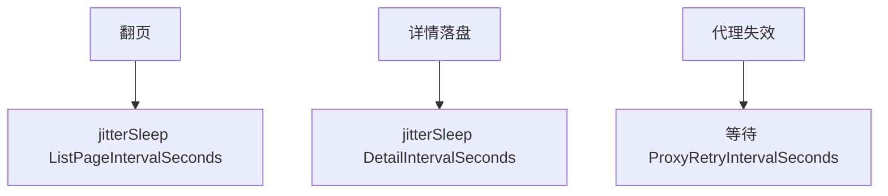

# 间隔类字段

`Config` 中控制请求节奏的 3 个字段，均以秒为单位，配合 [`Jitter`](./config-jitter) 实现随机化。

```go
ListPageIntervalSeconds   int
DetailIntervalSeconds     int
ProxyRetryIntervalSeconds int
```

## 字段表

| 字段 | 默认 | 触发点 | 说明 |
| --- | --- | --- | --- |
| ListPageIntervalSeconds | `3` | 翻页前 | 列表页之间的休眠 |
| DetailIntervalSeconds | `3` | 单条详情写盘后 | 详情请求之间的休眠 |
| ProxyRetryIntervalSeconds | `3` | 代理失效重试前 | 换 IP 前的等待 |

## 调用点

- `VulList` / `VulListWithQuery`：每页结束 `jitterSleep(ctx, config.ListPageIntervalSeconds, config.Jitter)`；每条详情结束 `jitterSleep(ctx, config.DetailIntervalSeconds, config.Jitter)`。
- `requestWithRetry`：代理失效时 `time.After(config.ProxyRetryIntervalSeconds)` 后换 IP 重试。
- `fetchAndSaveDetail`：代理失效 `jitterSleep(ctx, config.ProxyRetryIntervalSeconds, config.Jitter)`。



## Jitter 影响

实际休眠时长受 `Jitter` 影响：`Jitter=0` 时固定休眠 `baseSeconds`；`Jitter=0.5` 时休眠区间 `[base*0.5, base*1.5]`。详见 [Jitter](./config-jitter)。

## 示例

```go
cfg := cnvd_skills.DefaultConfig()
cfg.ListPageIntervalSeconds = 5
cfg.DetailIntervalSeconds = 2
cfg.ProxyRetryIntervalSeconds = 10
```
