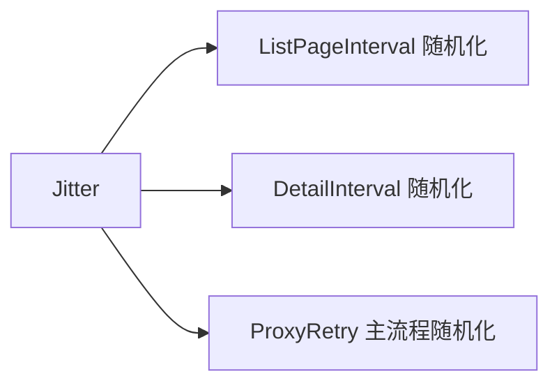

# Config.Jitter 字段

```go
Jitter float64
```

## 说明

翻页与详情请求间隔的随机抖动幅度，范围 `0~1`。`DefaultConfig()` 设为 `0.3`。

## 计算

`jitterSleep(ctx, baseSeconds, jitter)`：

- `Jitter=0`：固定休眠 `baseSeconds` 秒。
- `Jitter=0.5`：休眠区间 `[base*(1-0.5), base*(1+0.5)]`，即 `[base*0.5, base*1.5]`。

```go
d := time.Duration(baseSeconds) * time.Second
if jitter > 0 {
    span := float64(d) * jitter
    offset := time.Duration(globalRand.Float64()*2*span) - time.Duration(span)
    d = d + offset
}
```

`globalRand` 用时间戳播种，避免每次进程启动产生固定序列。

## 影响的间隔

| 间隔字段 | 是否受 Jitter |
| --- | --- |
| ListPageIntervalSeconds | 是（`jitterSleep`） |
| DetailIntervalSeconds | 是（`jitterSleep`） |
| ProxyRetryIntervalSeconds | 主流程用 `jitterSleep`；`requestWithRetry` 内用固定 `time.After` |



## 用途

模拟人类浏览节奏，降低被反爬识别为机器的概率。

## 示例

```go
cfg := cnvd_skills.DefaultConfig()
cfg.Jitter = 0.5  // ±50% 随机
```
