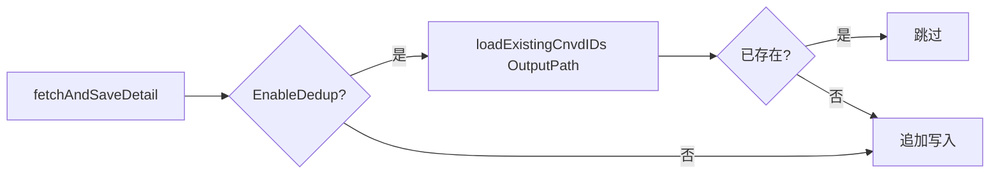

# Config.OutputPath 字段

```go
OutputPath string
```

## 说明

抓取结果输出文件路径，`VulList` / `VulListWithQuery` 主流程将每条 `VulDetail` 以 JSON 追加写入该文件（JSONL 格式）。

## 默认值

`DefaultConfig()` 设为 `data/test.jsonl`。生产环境建议改为业务相关路径如 `data/cnvd.jsonl`。

## 行为

- `fetchAndSaveDetail` 用 `os.OpenFile(OutputPath, O_CREATE|O_WRONLY|O_APPEND)` 追加。
- 父目录不存在时 `os.MkdirAll(parentDir(OutputPath))` 自动创建。
- 配合 [`EnableDedup`](./config-dedup) 实现续抓：每条详情抓取前读该文件，已存在 CNVD-ID 则跳过。



## 示例

```go
cfg := cnvd_skills.DefaultConfig()
cfg.OutputPath = "data/2026-07.jsonl"
```
