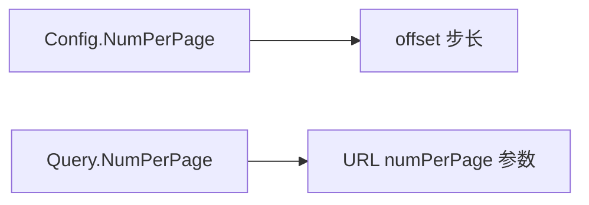

# Config.NumPerPage 字段

```go
NumPerPage int
```

## 说明

每页漏洞条目数。CNVD 列表页固定为 10，`DefaultConfig()` 设为 `10`。

## 用途

`VulList` / `VulListWithQuery` 主流程用 `NumPerPage` 计算 offset：

```go
offset := (page - 1) * config.NumPerPage
```

`RequestVulListByOffsetWithConfig` 内部固定拼 `numPerPage=10`（CNVD 列表页真实固定值），`NumPerPage` 主要影响主流程翻页 offset 步长。

## 命名说明

`VulListQuery.NumPerPage` 是检索版的同名字段，经 `buildQueryURL` 拼入 URL（0 时用默认 10）。



## 示例

```go
cfg := cnvd_skills.DefaultConfig()
cfg.NumPerPage = 10 // 保持默认
```
