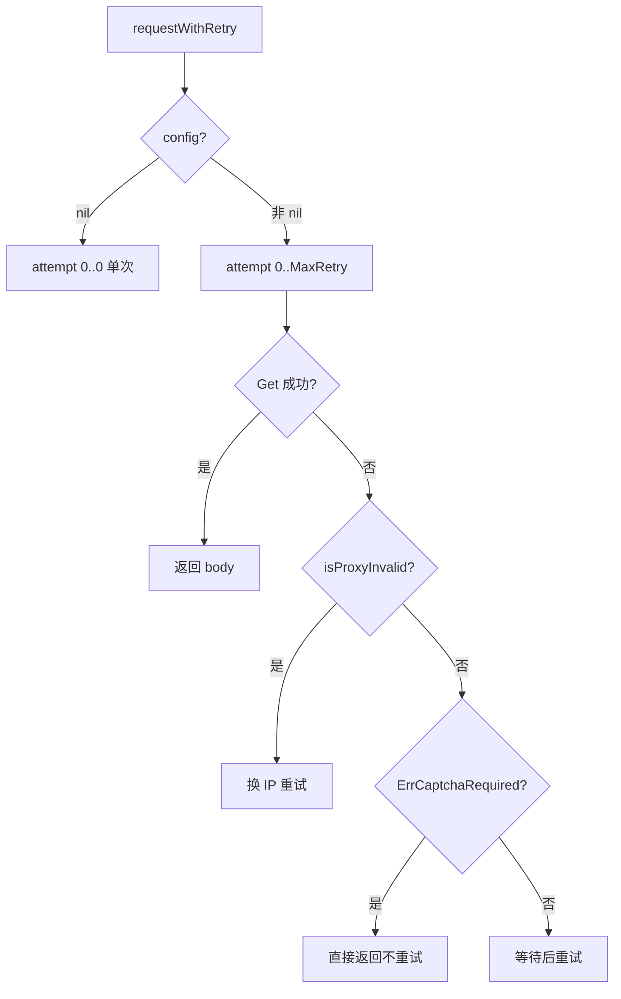

# 重试与超时字段

```go
MaxRetry              int
RequestTimeoutSeconds int
```

## 字段表

| 字段 | 默认 | 说明 |
| --- | --- | --- |
| MaxRetry | `3` | 单次请求最大重试次数（0=不重试，直接返回错误） |
| RequestTimeoutSeconds | `30` | 单次请求超时（秒，0=不限） |

## 作用域

仅在 `requestWithRetry` 中，`config != nil` 时读取：

```go
if config != nil {
    maxRetry = config.MaxRetry
    timeoutSec = config.RequestTimeoutSeconds
    solver = config.CaptchaSolver
}
for attempt := 0; attempt <= maxRetry; attempt++ {
    client := jsl.NewJslClient(proxy, timeoutSec, solver)
    ...
}
```

## 重试流程



验证码错误（`jsl.ErrCaptchaRequired`）不重试，直接返回，需调用方配置 [`CaptchaSolver`](./config-captcha-solver)。

## 示例

```go
cfg := cnvd_skills.DefaultConfig()
cfg.MaxRetry = 5
cfg.RequestTimeoutSeconds = 60
```
