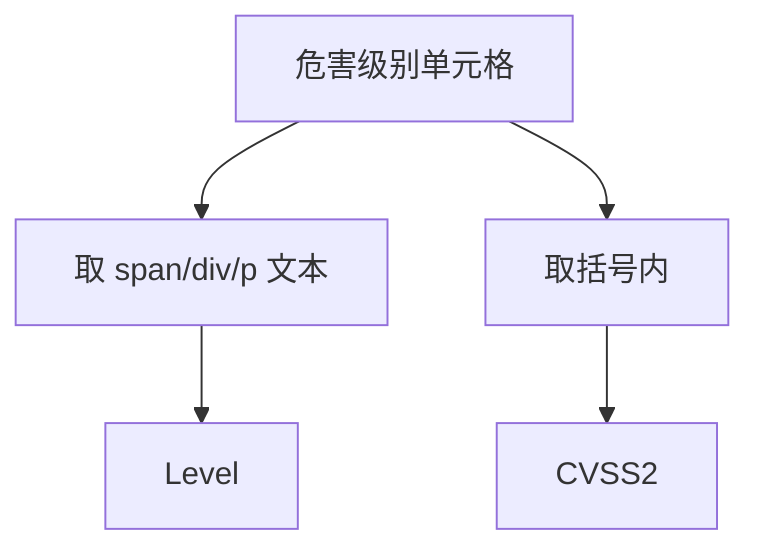
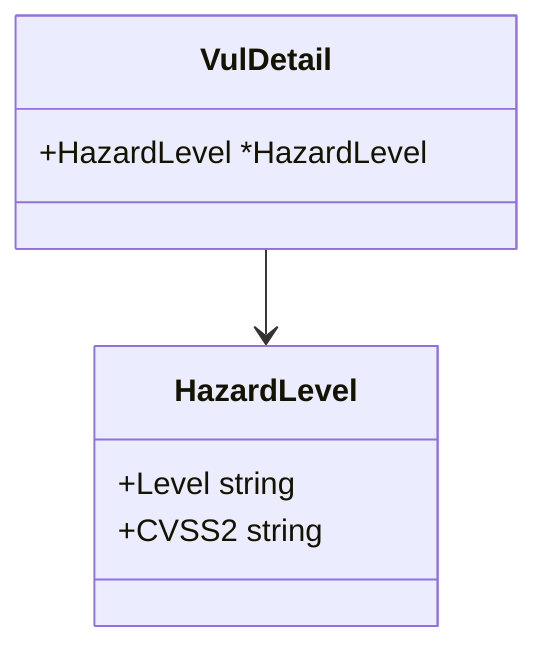

# HazardLevel 字段

```go
type HazardLevel struct {
    Level  string
    CVSS2 string
}
```

## 字段表

| 字段 | 类型 | 默认 | 说明 | 示例 |
| --- | --- | --- | --- | --- |
| Level | `string` | `""` | 评级文本 | `高` / `中` / `低` / `严重` |
| CVSS2 | `string` | `""` | CVSS2 评分 | `7.5` |

## 解析

`parseHazardLevel` 从「危害级别」单元格解析。CNVD 使用 CVSS2 评分系统。

- 优先取 `span`/`div`/`p` 子节点文本作 `Level`。
- `CVSS2` 取 `fallbackText` 中括号内文本。



## 空值情况

- 无子节点且无括号：仅 `Level` 有值，`CVSS2` 为空。
- 整格为空：`HazardLevel` 在 `VulDetail` 中为 `nil`（`parseHazardLevel` 不会被调用）。

## 关系



## 示例

```go
d, _ := x.FetchVulDetail(ctx, "CNVD-2021-67823", proxy)
if d.HazardLevel != nil {
    fmt.Printf("级别=%s CVSS2=%s\n", d.HazardLevel.Level, d.HazardLevel.CVSS2)
}
```

详见 [危害级别详解](./vul-detail-hazard-level)。
