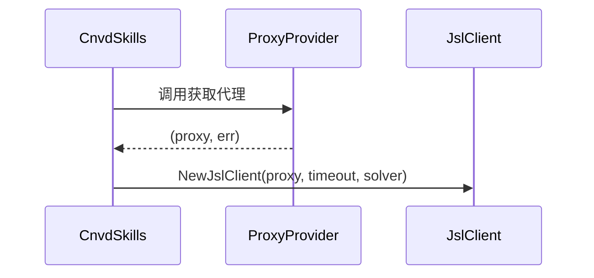

# ProxyProvider 类型

```go
type ProxyProvider func() (string, error)
```

## 说明

`ProxyProvider` 是函数类型，返回代理地址字符串（`http://host:port` 格式）供 `jsl.NewJslClient` 使用。

## 契约

- 成功：返回非空代理 URL 与 `nil`。
- 失败：返回空串与 `error`，调用方据此决定重试。
- 返回 `""` 等价直连（`FixedProxyProvider("")`）。



## 内置实现

- [`FixedProxyProvider`](../methods/fixed-proxy-provider)：固定 IP，始终返回同一值。
- [`PinYiProxyProvider`](../methods/pinyi-proxy-provider)：调用品易 API 动态获取。

## 调用点

`requestWithRetry` 启动时与代理失效重试时各调一次：

```go
proxy, err := proxyProvider()
...
if isProxyInvalid(getErr) {
    if newProxy, pErr := proxyProvider(); pErr == nil {
        proxy = newProxy
    }
    continue
}
```

## isProxyInvalid 判定

以下错误归类为代理错误（应换 IP 重试）：

- `read tcp ` 前缀
- `unexpected EOF` 后缀
- 含 `proxyconnect` / `EOF` / `connection refused` / `i/o timeout` / `context deadline exceeded`

## 自定义实现

```go
myProvider := func() (string, error) {
    return "http://127.0.0.1:8080", nil
}
```

详见示例 [代理轮换](../examples/proxy-rotation)。
