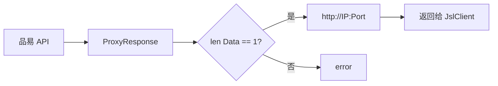
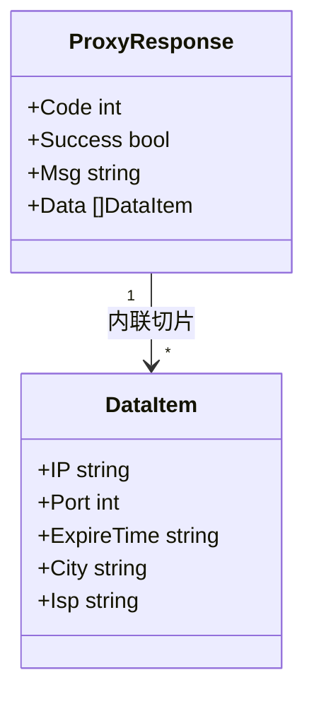

# ProxyResponse 字段

`ProxyResponse` 是品易代理 API 的响应结构。

```go
type ProxyResponse struct {
    Code    int    `json:"code"`
    Success bool   `json:"success"`
    Msg     string `json:"msg"`
    Data    []struct {
        IP         string `json:"ip"`
        Port       int    `json:"port"`
        ExpireTime string `json:"expire_time"`
        City       string `json:"city"`
        Isp        string `json:"isp"`
    } `json:"data"`
}
```

## 顶层字段

| 字段 | 类型 | JSON | 说明 |
| --- | --- | --- | --- |
| Code | `int` | `code` | 业务码 |
| Success | `bool` | `success` | 是否成功 |
| Msg | `string` | `msg` | 提示消息 |
| Data | `[]struct` | `data` | IP 列表 |

## Data 内联结构

| 字段 | 类型 | JSON | 说明 |
| --- | --- | --- | --- |
| IP | `string` | `ip` | 代理 IP |
| Port | `int` | `port` | 端口 |
| ExpireTime | `string` | `expire_time` | 过期时间 |
| City | `string` | `city` | 城市 |
| Isp | `string` | `isp` | 运营商 |

## PinYiProxyProvider 使用

```go
json, err := requests.GetJson[*ProxyResponse](context.Background(), targetUrl)
if err != nil { return "", err }
if len(json.Data) != 1 {
    return "", fmt.Errorf("failed: %#v", json)
}
return fmt.Sprintf("http://%s:%d", json.Data[0].IP, json.Data[0].Port), nil
```



## 关系



`Data` 是匿名结构体切片，未单独命名类型。
