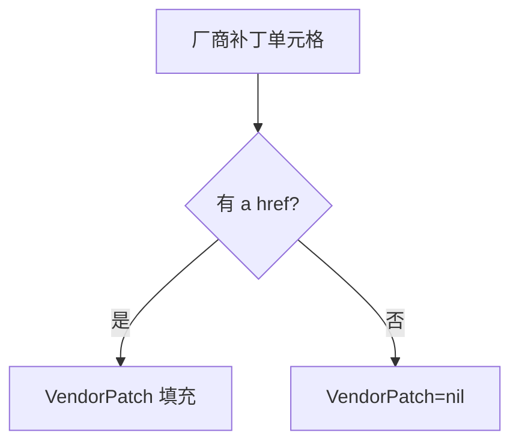
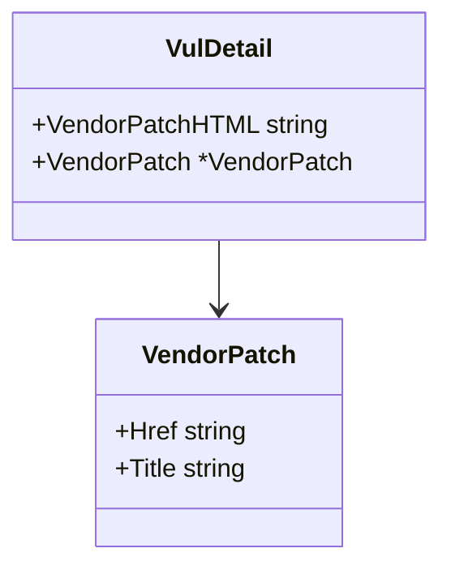

# VendorPatch 字段

```go
type VendorPatch struct {
    Href  string
    Title string
}
```

## 字段表

| 字段 | 类型 | 默认 | 说明 | 示例 |
| --- | --- | --- | --- | --- |
| Href | `string` | `""` | 补丁详情页相对链接 | `/patchInfo/show/289241` |
| Title | `string` | `""` | 补丁标题文本 | `Apache Log4j 补丁` |

## 解析

`ParseVulDetail` 在 `case "厂商补丁"` 分支：

```go
patchHref, _ := valueSelection.Find("a").First().Attr("href")
patchTitle := valueSelection.Find("a").First().Text()
if patchHref != "" {
    detail.VendorPatch = &VendorPatch{
        Href:  patchHref,
        Title: strings.TrimSpace(patchTitle),
    }
}
```

`VendorPatch` 仅在存在 `a[href]` 时填充，否则为 `nil`。`Title` 经 `TrimSpace` 去除多余空白。



## 用途

`Href` 拼接为补丁详情页 URL，供 [`RequestVulPatchByURL`](../methods/request-vul-patch) 抓取结构化补丁信息：

```go
patchURL := "https://www.cnvd.org.cn" + detail.VendorPatch.Href
p, _ := x.RequestVulPatchByURL(ctx, patchURL, proxy)
```

## 关系



## 示例

```go
d, _ := x.FetchVulDetail(ctx, "CNVD-2021-67823", proxy)
if d.VendorPatch != nil {
    fmt.Println(d.VendorPatch.Title, d.VendorPatch.Href)
}
```

详见 [厂商补丁详解](./vul-detail-vendor-patch)。
