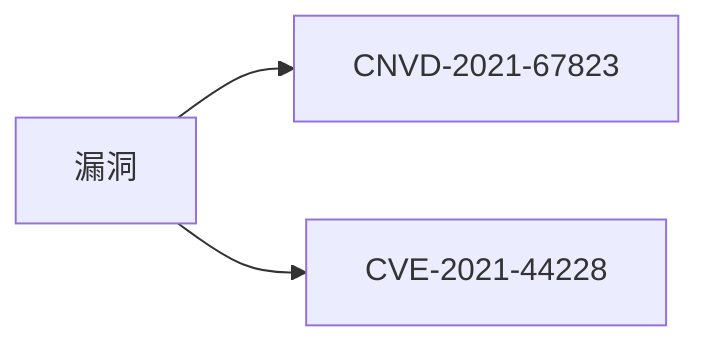

# CVE 字段

`VulDetail.CVE` 承载漏洞对应的 CVE 编号。

```go
CVE string
```

## 字段

| 字段 | 类型 | 来源 key | 示例 |
| --- | --- | --- | --- |
| CVE | `string` | 详情页 `td` key=`CVE ID` | `CVE-2021-44228` |

## 来源 HTML

```html
<tr><td>CVE ID</td><td>CVE-2021-44228</td></tr>
```

`ParseVulDetail` 在 `case "CVE ID"` 分支 `detail.CVE = valueText`。CNVD 部分漏洞无对应 CVE，此时该单元格为空，`CVE` 留空字符串。

## 与 CNVD 的关系

CNVD 是中国国家级编号，CVE 是国际编号。同一条漏洞可同时具备两者：



无 CVE 的漏洞（如国产软件漏洞）`CVE` 为 `""`，调用方需做空值判断。

## 示例

```go
d, _ := x.FetchVulDetail(ctx, "CNVD-2021-67823", proxy)
if d.CVE != "" {
    fmt.Println("关联 CVE:", d.CVE)
}
```
