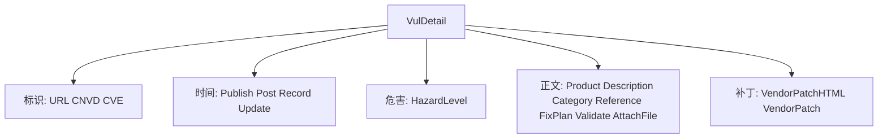

# VulDetail 字段逐项

`VulDetail` 21 个字段逐项详解。完整结构见 [VulDetail 类型](../vul-detail)。

```go
type VulDetail struct {
    URL              string
    CNVD             string
    CVE              string
    PublishTimeStr   string
    PublishTime      *time.Time
    HazardLevel      *HazardLevel
    Product          string
    Description      string
    Category         string
    Reference        string
    FixPlan          string
    VendorPatchHTML  string
    VendorPatch      *VendorPatch
    Validate         string
    PostTimeStr      string
    PostTime         *time.Time
    RecordTimeStr    string
    RecordTime       *time.Time
    UpdateTimeStr    string
    UpdateTime       *time.Time
    AttachFile       string
}
```

## 字段逐项

| 字段 | 类型 | 默认 | 用途 | 来源 HTML |
| --- | --- | --- | --- | --- |
| URL | `string` | `""` | 详情页 URL | 调用方传入 |
| CNVD | `string` | `""` | CNVD 编号 | `td` key=`CNVD-ID` |
| CVE | `string` | `""` | CVE 编号 | `td` key=`CVE ID` |
| PublishTimeStr | `string` | `""` | 公开日期字符串 | `td` key=`公开日期` |
| PublishTime | `*time.Time` | `nil` | 公开日期 | 解析自 Str |
| HazardLevel | `*HazardLevel` | `nil` | 危害级别 | `td` key=`危害级别` |
| Product | `string` | `""` | 影响产品 | `td` key=`影响产品` |
| Description | `string` | `""` | 漏洞描述 | `td` key=`漏洞描述` |
| Category | `string` | `""` | 漏洞类型 | `td` key=`漏洞类型` |
| Reference | `string` | `""` | 参考链接 | `td` key=`参考链接` |
| FixPlan | `string` | `""` | 解决方案 | `td` key=`漏洞解决方案` |
| VendorPatchHTML | `string` | `""` | 厂商补丁原始 HTML | `td` key=`厂商补丁` |
| VendorPatch | `*VendorPatch` | `nil` | 厂商补丁结构化 | 同上 `a href/title` |
| Validate | `string` | `""` | 验证信息 | `td` key=`验证信息` |
| PostTimeStr/PostTime | — | — | 报送时间 | `td` key=`报送时间` |
| RecordTimeStr/RecordTime | — | — | 收录时间 | `td` key=`收录时间` |
| UpdateTimeStr/UpdateTime | — | — | 更新时间 | `td` key=`更新时间` |
| AttachFile | `string` | `""` | 漏洞附件链接 | `td` key=`漏洞附件` `a href` |

各字段分组详解见子页：[URL/CNVD](./vul-detail-url-cnvd)、[CVE](./vul-detail-cve)、[时间](./vul-detail-times)、[HazardLevel](./vul-detail-hazard-level)、[厂商补丁](./vul-detail-vendor-patch)、[其他](./vul-detail-others)。

## 字段关系



## 解析机制

`ParseVulDetail` 遍历 `.gg_detail tr`，第一列 `td` 为 key，下一列为 value，`switch key` 分发赋值。value 取原始 `Html()` 后经 `decodeHTMLEntities` 解码实体，避免 `&amp;` 等脏数据。
