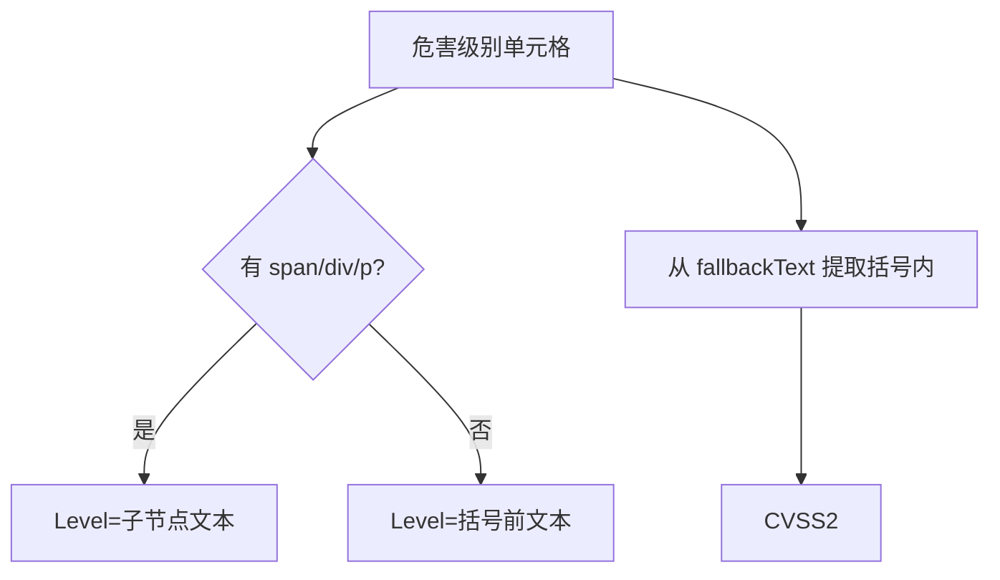
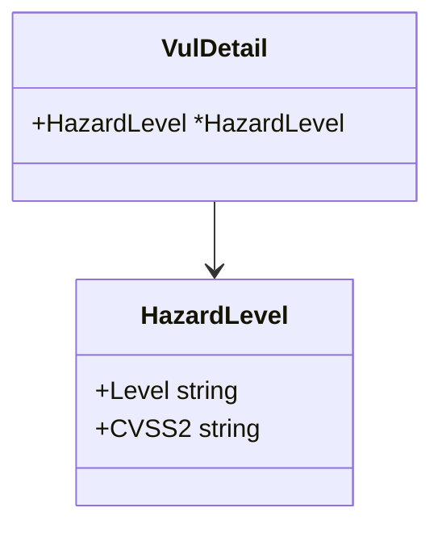

# 危害级别 HazardLevel

`VulDetail.HazardLevel` 是 `*HazardLevel` 指针，承载漏洞评级与 CVSS2 评分。

```go
type HazardLevel struct {
    Level  string
    CVSS2 string
}
```

## 字段表

| 字段 | 类型 | 说明 | 示例 |
| --- | --- | --- | --- |
| Level | `string` | 评级文本 | `高` / `中` / `低` / `严重` |
| CVSS2 | `string` | CVSS2 评分 | `7.5` |

## 解析逻辑 parseHazardLevel

```go
func parseHazardLevel(valueSelection *goquery.Selection, fallbackText string) *HazardLevel
```

- 优先取单元格内 `span`/`div`/`p` 子节点的文本作为 `Level`。
- 若无子节点，从 `fallbackText` 按括号拆分：`高 (7.5)` → `Level=高`、`CVSS2=7.5`。
- `CVSS2` 取括号内文本；无括号则为空串。



## 来源 HTML 形态

```html
<!-- 形态1：span 包裹 -->
<tr><td>危害级别</td><td><span>高</span>(7.5)</td></tr>

<!-- 形态2：纯文本 -->
<tr><td>危害级别</td><td>中 (5.0)</td></tr>
```

## 关系



## 示例

```go
d, _ := x.FetchVulDetail(ctx, "CNVD-2021-67823", proxy)
if d.HazardLevel != nil {
    fmt.Println(d.HazardLevel.Level, d.HazardLevel.CVSS2)
}
```

详见 [HazardLevel 字段](./hazard-level-fields)。
