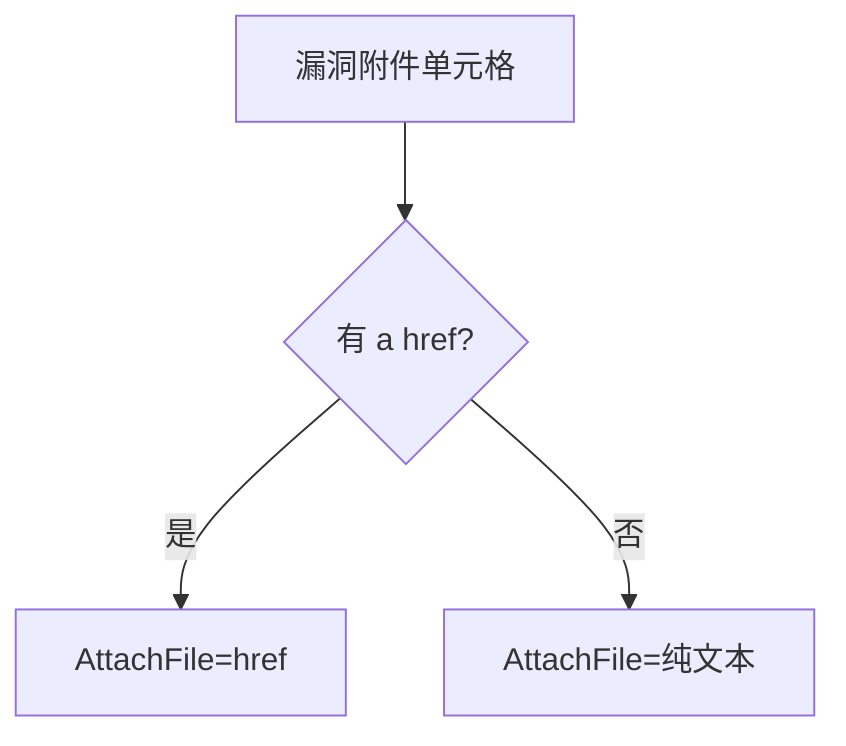

# 其他正文字段

`VulDetail` 中除标识、时间、危害、补丁外的正文字段。

```go
Product      string
Description  string
Category     string
Reference    string
FixPlan      string
Validate     string
AttachFile   string
```

## 字段表

| 字段 | 类型 | 来源 key | 说明 |
| --- | --- | --- | --- |
| Product | `string` | `影响产品` | 受影响的产品及版本 |
| Description | `string` | `漏洞描述` | 漏洞技术描述 |
| Category | `string` | `漏洞类型` | 漏洞分类（如 SQL 注入、XSS） |
| Reference | `string` | `参考链接` | 外部参考链接文本 |
| FixPlan | `string` | `漏洞解决方案` | 修复建议 |
| Validate | `string` | `验证信息` | 验证状态 |
| AttachFile | `string` | `漏洞附件` | 附件 `a href` 或文本 |

## AttachFile 解析

```go
case "漏洞附件":
    attachHref, _ := valueSelection.Find("a").First().Attr("href")
    if attachHref != "" {
        detail.AttachFile = attachHref
    } else {
        detail.AttachFile = valueText
    }
```

优先取 `a[href`，无则退化为纯文本。



## 共性

以上字段均经 `decodeHTMLEntities` 解码，压缩多余空白，确保 `&amp;` / `&lt;` 等实体被还原。空单元格留空字符串。

## 示例

```go
d, _ := x.FetchVulDetail(ctx, "CNVD-2021-67823", proxy)
fmt.Println(d.Product, d.Category)
fmt.Println(d.Description)
if d.AttachFile != "" {
    fmt.Println("附件:", d.AttachFile)
}
```
