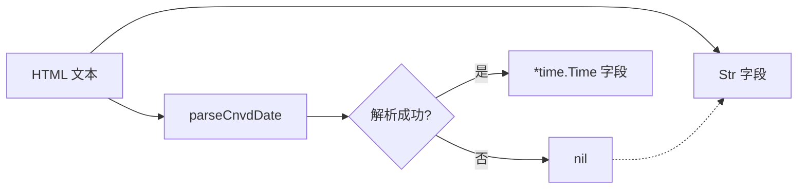

# 时间字段

`VulDetail` 有 4 组时间字段，每组含 `Str`（原文字符串）与 `*time.Time`（解析后）双形态。

```go
PublishTimeStr string
PublishTime    *time.Time
PostTimeStr    string
PostTime       *time.Time
RecordTimeStr  string
RecordTime     *time.Time
UpdateTimeStr  string
UpdateTime     *time.Time
```

## 字段表

| 组 | Str 字段 | time 字段 | 来源 key | 含义 |
| --- | --- | --- | --- | --- |
| 公开 | PublishTimeStr | PublishTime | `公开日期` | 漏洞公开日期 |
| 报送 | PostTimeStr | PostTime | `报送时间` | 报送方提交时间 |
| 收录 | RecordTimeStr | RecordTime | `收录时间` | CNVD 收录时间 |
| 更新 | UpdateTimeStr | UpdateTime | `更新时间` | 最近更新时间 |

## 解析逻辑 parseCnvdDate

```go
func parseCnvdDate(s string) *time.Time
```

依次尝试 4 种 layout，全部失败返回 `nil`（不报错，调用方用 Str 字段兜底）：

| layout |
| --- |
| `2006-01-02 15:04:05` |
| `2006-01-02` |
| `2006/01/02 15:04:05` |
| `2006/01/02` |

解析用 `time.ParseInLocation(layout, s, time.Local)`。

## 双形态设计



`Str` 保证原始数据不丢失，`*time.Time` 便于排序、范围过滤。`nil` 时调用方回退到 `Str`。

## 示例

```go
d, _ := x.FetchVulDetail(ctx, "CNVD-2021-67823", proxy)
fmt.Println("公开:", d.PublishTimeStr)
if d.PublishTime != nil {
    fmt.Println("公开(解析):", d.PublishTime.Format("2006-01-02"))
}
```
