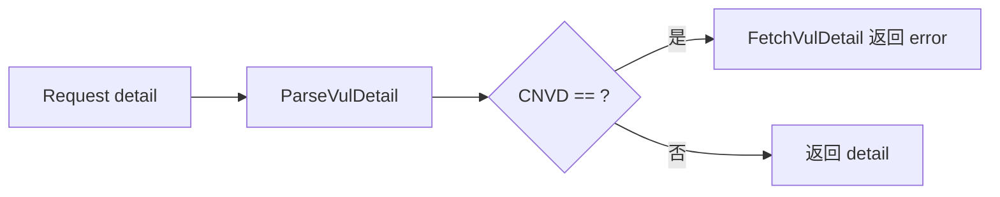

# URL 与 CNVD 字段

`VulDetail.URL` 与 `VulDetail.CNVD` 是漏洞的标识字段。

```go
URL  string
CNVD string
```

## 字段

| 字段 | 类型 | 来源 | 示例 |
| --- | --- | --- | --- |
| URL | `string` | 调用方传入（`RequestVulDetailByURLWithConfig` 内 `detail.URL = detailPageURL`） | `https://www.cnvd.org.cn/flaw/show/CNVD-2021-67823` |
| CNVD | `string` | 详情页 `td` key=`CNVD-ID` | `CNVD-2021-67823` |

## 来源 HTML

```html
<div class="gg_detail">
  <table><tr><td>CNVD-ID</td><td>CNVD-2021-67823</td></tr></table>
</div>
```

`ParseVulDetail` 在 `case "CNVD-ID"` 分支 `detail.CNVD = valueText`。`URL` 不来自 HTML，由 `RequestVulDetailByURLWithConfig` 在解析后回填。

## FetchVulDetail 的空值校验

[`FetchVulDetailWithConfig`](../methods/fetch-vul-detail) 在解析成功后检查 `detail.CNVD == ""`，为空则返回 `fmt.Errorf("parsed detail for %s has empty CNVD-ID", cnvd)`，防止抓到空页被误判为成功。



## 示例

```go
d, err := x.FetchVulDetail(ctx, "CNVD-2021-67823", proxy)
// d.URL == "https://www.cnvd.org.cn/flaw/show/CNVD-2021-67823"
// d.CNVD == "CNVD-2021-67823"
```
